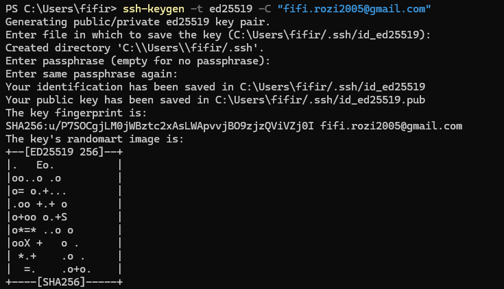
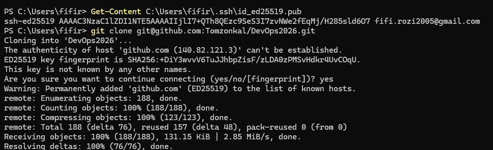
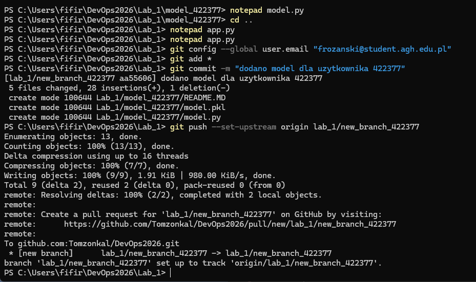
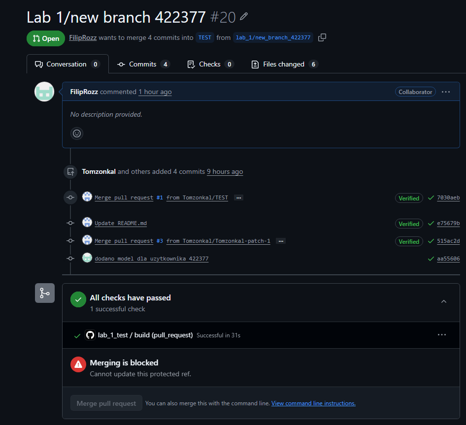

# Sprawozdanie – Laboratorium 1: Git i GitHub

**Autor:** Filip Różański 
**Nr indeksu:** 422377  
**Gałąź:** `lab_1/new_branch_422377`  
**Data:** 17.032026

---

## Spis treści

1. [Cel laboratorium](#1-cel-laboratorium)
2. [Prerequisites](#2-prerequisites)
3. [Weryfikacja działania](#3-weryfikacja-działania)
4. [Opis komend i efektów](#4-opis-komend-i-efektów)
5. [Dokumentacja techniczna](#5-dokumentacja-techniczna)
6. [Tematy dodatkowe](#6-tematy-dodatkowe)
7. [Podsumowanie](#7-podsumowanie)

---

## 1. Cel laboratorium

Celem laboratorium było zapoznanie się z podstawowym workflow Gita i GitHuba. Główne zadania obejmowały:

- konfigurację klucza SSH do uwierzytelniania z GitHubem,
- sklonowanie repozytorium i stworzenie własnej gałęzi roboczej,
- rozszerzenie istniejącej aplikacji Flask o nowy endpoint serwujący predykcje modelu ML,
- zatwierdzenie zmian commitami, wypchnięcie ich na zdalne repozytorium,
- weryfikację poprawności przez zautomatyzowany pipeline CI (GitHub Actions) w ramach Pull Requesta.

---

## 2. Prerequisites

| Wymaganie | Minimalna wersja | Jak sprawdzić |
|---|---|---|
| Git | 2.35+ | `git --version` |
| Python | 3.9+ | `python --version` |
| Konto GitHub | – | dostęp do repo kursu |
| Klucz SSH w GitHubie | – | `ssh -T git@github.com` |

Biblioteki Python (plik `requirements`):
- `flask`
- `scikit-learn`
- `pytest`
- `requests`

---

## 3. Weryfikacja działania

### Screenshot 1 – Generowanie klucza SSH

Terminal z komendą `ssh-keygen -t ed25519 -C "fifi.rozi2005@gmail.com"` – widoczne pomyślne wygenerowanie pary kluczy i zapisanie ich w `C:\Users\fifir\.ssh\`.



---

### Screenshot 2 – Wyświetlenie klucza publicznego i klonowanie repozytorium

Terminal z komendą `Get-Content` wyświetlającą klucz publiczny, a następnie pomyślne wykonanie `git clone git@github.com:Tomzonkal/DevOps2026.git` – repozytorium zostało pobrane lokalnie.



---

### Screenshot 3 – Edycja plików, commit i push

Terminal pokazujący kolejno: otwarcie `model.py` i `app.py` w notatniku, konfigurację emaila git, `git add *`, pomyślny `git commit` (5 plików zmienionych) oraz `git push --set-upstream origin lab_1/new_branch_422377` – gałąź wypchana na GitHuba.



---

### Screenshot 4 – Pull Request z zielonymi testami

Widok PR #20 na GitHubie: `FilipRozz` chce mergować `lab_1/new_branch_422377` do `TEST` – widoczny zielony status **"All checks have passed"** (1 successful check w 31s).



---

## 4. Opis komend i efektów

### Krok 1 – Generowanie klucza SSH

```bash
ssh-keygen -t ed25519 -C "twoj_email@example.com"
```

Generuje parę kluczy asymetrycznych algorytmem Ed25519. W katalogu `~/.ssh/` powstają dwa pliki:
- `id_ed25519` – klucz **prywatny** (nigdy nie udostępniamy),
- `id_ed25519.pub` – klucz **publiczny** (wgrywamy na GitHuba).

Ed25519 jest aktualnie zalecanym algorytmem – jest bezpieczniejszy i wydajniejszy od starszego RSA.

---

### Krok 2 – Wyświetlenie klucza publicznego i dodanie go do GitHuba

```powershell
Get-Content C:\Users\fifir\.ssh\id_ed25519.pub
```

Wyświetla zawartość klucza publicznego. Skopiowany klucz wklejamy na GitHubie w: **Settings → SSH and GPG keys → New SSH key**.

Weryfikacja połączenia:
```bash
ssh -T git@github.com
```
Poprawna odpowiedź: `Hi <username>! You've successfully authenticated.`

---

### Krok 3 – Klonowanie repozytorium

```bash
git clone git@github.com:Tomzonkal/DevOps2026.git
cd DevOps2026
```

`git clone` pobiera całą historię projektu wraz ze wszystkimi gałęziami i commitami – nie tylko aktualny stan plików. Folder `Lab_1/` zawiera bazową aplikację Flask z przykładowym modelem `model_0000`, który służy jako szablon.

Błąd `Permission denied (publickey)` oznacza że klucz SSH nie jest poprawnie skonfigurowany – należy wrócić do Kroku 1.

---

### Krok 4 – Konfiguracja tożsamości Gita

```bash
git config --global user.email "twoj_email@example.com"
git config --global user.name "TwojeImie"
```

Ustawia dane autora commitów globalnie dla całego systemu. Wykonuje się to jednorazowo na danym komputerze. Dane te pojawiają się w historii commitów i powinny zgadzać się z kontem GitHub.

---

### Krok 5 – Stworzenie gałęzi roboczej

```bash
git switch -c lab_1/new_branch_422377
```

Tworzy nową gałąź i od razu na nią przechodzi (`-c` = create). Kolejne commity trafiają na tę gałąź, nie ruszamy `main`. Prefix `lab_1/` to konwencja nazewnicza – GitHub grupuje gałęzie z tym samym prefixem w widoku listy.

Weryfikacja aktywnej gałęzi:
```bash
git branch
```
Gwiazdka `*` przy nazwie = jesteśmy we właściwym miejscu.

---

### Krok 6 – Skopiowanie folderu modelu

```powershell
Copy-Item -Recurse model_0000 model_422377
```

Kopiuje cały folder szablonu. Nowy folder zawiera `model.py` z logiką predykcji i `model.pkl` – wytrenowany model scikit-learn w formacie pickle. Pliku `model.pkl` **nie zmieniamy** – ma zwracać z góry określony wynik, który sprawdzają testy.

---

### Krok 7 – Edycja `config.py`

```python
id_list = [
    "0000",
    "123456",
    "422377"   # <- dodajemy swój numer indeksu
]
```

Lista `id_list` jest odczytywana przez `api_test.py`. Pytest używa `@pytest.mark.parametrize` żeby automatycznie wygenerować osobny test dla każdego ID z listy. Brak wpisu = brak testu = brak zaliczenia, nawet jeśli endpoint działa poprawnie.

---

### Krok 8 – Edycja `model_422377/model.py`

```python
# Przed:
def run_model_0000(input):

# Po:
def run_model_422377(input):
```

Zmiana nazwy funkcji na unikalną zapobiega konfliktom z funkcjami innych studentów przy imporcie w `app.py`.

---

### Krok 9 – Edycja `app.py`

Dodanie importu na początku pliku:
```python
from model_422377 import model as model_422377
```

Skopiowanie i dostosowanie endpointu:
```python
@app.route('/api/model_422377', methods=['POST'])
def model_422377_input():
    data = request.get_json()
    input = data["input"]
    result = model_422377.run_model_422377(input=input)
    return jsonify({'result': result}), 200
```

Dekorator `@app.route` rejestruje funkcję jako handler HTTP dla konkretnej ścieżki. Flask mapuje przychodzące requesty na odpowiednie funkcje na podstawie URL i metody HTTP. `request.get_json()` parsuje body requestu z formatu JSON.

---

### Krok 10 – Staging i commit

```bash
git add *
git commit -m "dodano model dla uzytkownika 422377"
```

`git add *` dodaje zmienione pliki do strefy staging. `git commit` zapisuje snapshot ze staging do lokalnej historii – zmiany są na razie tylko lokalnie, jeszcze nie na serwerze. Ta dwuetapowość to cecha Gita jako rozproszonego systemu kontroli wersji.

---

### Krok 11 – Push

```bash
git push --set-upstream origin lab_1/new_branch_422377
```

Wysyła lokalną gałąź na GitHuba i ustawia tracking branch. Kolejne `git push` nie będą wymagać podawania pełnej nazwy gałęzi.

---

### Krok 12 – Pull Request do gałęzi TEST

Przez interfejs GitHuba: **Pull requests → New pull request**, ustawiamy:
- **base:** `TEST`
- **compare:** `lab_1/new_branch_422377`

GitHub Actions odpala pytest automatycznie po utworzeniu PR i raportuje wynik bezpośrednio w widoku Pull Requesta.

---

## 5. Dokumentacja techniczna

### Overview

Laboratorium 1 z DevOpsa polegało na przejściu przez podstawowy workflow Gita i GitHuba (tzw. **GitHub Flow**). Głównym zadaniem było sklonowanie istniejącego repozytorium, stworzenie własnej gałęzi roboczej, rozszerzenie aplikacji Flask o nowy endpoint serwujący predykcje modelu ML, a na koniec wypchnięcie zmian i weryfikacja przez zautomatyzowany pipeline CI.

### Architektura aplikacji

Aplikacja zbudowana jest w oparciu o framework **Flask** (Python). Każdy student dodaje własny endpoint REST o ścieżce `/api/model_<nr_indeksu>`, który przyjmuje dane wejściowe w formacie JSON, przekazuje je do wytrenowanego modelu scikit-learn i zwraca predykcję.

```
DevOps2026/
└── Lab_1/
    ├── app.py              # Główna aplikacja Flask – wszystkie endpointy
    ├── config.py           # Lista ID studentów – napędza parametryzację testów
    ├── api_test.py         # Testy pytest – automatycznie testują każdy endpoint
    ├── model_0000/         # Szablon modelu
    │   ├── model.pkl
    │   └── model.py
    └── model_422377/       # Nasz model (kopia szablonu)
        ├── model.pkl
        └── model.py
```

### Jak działają testy automatyczne

Plik `api_test.py` korzysta z dekoratora `@pytest.mark.parametrize`, który pobiera listę ID z `config.py` i generuje osobny test dla każdego wpisu. Test wysyła żądanie POST na endpoint `/api/model_<id>` z przykładowymi danymi i sprawdza czy odpowiedź ma status 200 i zawiera pole `result`.

```python
# Uproszczony schemat działania testów:
@pytest.mark.parametrize("model_id", id_list)
def test_api_models(model_id):
    response = requests.post(f"/api/model_{model_id}", json={"input": [[1,2,3,4]]})
    assert response.status_code == 200
    assert "result" in response.json()
```

### Jak działa model ML

Plik `model.pkl` zawiera wytrenowany model scikit-learn zapisany w formacie pickle. Funkcja `run_model_422377` ładuje model przy każdym wywołaniu, przekazuje dane wejściowe do metody `predict()` i konwertuje wynik do typu `float`.

```python
import pickle
import os

def run_model_422377(input):
    path = os.path.dirname(__file__)
    with open(path + "/model.pkl", "rb") as f:
        model = pickle.load(f)
    result = model.predict(input)
    result = float(result[0])
    return result
```

`os.path.dirname(__file__)` zwraca ścieżkę do katalogu w którym leży `model.py`. Konwersja `float(result[0])` jest konieczna, ponieważ `predict()` zwraca tablicę numpy, która może powodować problemy przy serializacji do JSON przez Flask.

### Oczekiwany output

Test manualny (curl):
```bash
curl -X POST http://localhost:5000/api/model_422377 \
     -H "Content-Type: application/json" \
     -d '{"input": [[1, 2, 3, 4]]}'
# {"result": 2.0}
```

Wynik testów pytest:
```
collected 3 items

api_test.py::test_api_models[0000] PASSED
api_test.py::test_api_models[123456] PASSED
api_test.py::test_api_models[422377] PASSED

====== 3 passed in 0.42s ======
```

---

## 6. Tematy dodatkowe

### git fetch vs git pull

`git fetch` pobiera zmiany ze zdalnego repozytorium, ale **nie scala** ich z lokalną gałęzią – aktualizuje tylko tzw. remote-tracking branches (np. `origin/main`). Pozwala podejrzeć co się zmieniło zanim zdecydujemy co z tym zrobić.

`git pull` to w skrócie `git fetch` + `git merge` – pobiera zmiany i od razu scala je z aktualną gałęzią. Jest wygodniejszy do codziennego użytku, ale mniej kontrolowalny.

**Kiedy używać fetch?** Gdy chcemy najpierw zobaczyć zmiany (`git log origin/main`) i świadomie zdecydować czy chcemy merge czy rebase.

---

### Local repository vs Remote repository

**Local repository** – kopia repozytorium na naszym dysku. Wszystkie commity, gałęzie i historia są dostępne offline. To tu pracujemy na co dzień.

**Remote repository** – repozytorium na serwerze (np. GitHub). Służy jako centralne miejsce wymiany kodu między programistami. Operacje `push` i `pull` synchronizują lokalne repo z zdalnym.

Kluczowa różnica: Git jest systemem **rozproszonym** – każda kopia repozytorium jest pełnoprawnym repozytorium z całą historią, nie tylko wycinkiem aktualnego stanu.

---

### Gitflow vs GitHub Flow

**Gitflow** to rozbudowany model pracy z wieloma typami gałęzi:
- `main` – tylko stabilne wersje produkcyjne,
- `develop` – integracja bieżących prac,
- `feature/*` – nowe funkcjonalności,
- `release/*` – przygotowanie wydania,
- `hotfix/*` – pilne poprawki produkcyjne.

Gitflow dobrze sprawdza się przy oprogramowaniu z wyraźnymi, numerowanymi wersjami (np. aplikacje desktopowe, biblioteki).

**GitHub Flow** to uproszczony model:
- `main` – zawsze deployowalny,
- krótkie gałęzie feature → Pull Request → merge do `main`.

GitHub Flow jest prostszy i lepiej pasuje do aplikacji webowych z ciągłym deploymentem (CI/CD), gdzie wypuszczamy zmiany często, bez formalnych wersji.

---

### Po co używa się release branchy?

Release branch (np. `release/1.2.0`) tworzy się gdy kod jest gotowy do wydania, ale wymaga jeszcze:
- ostatnich poprawek bugów (bez nowych funkcji),
- aktualizacji numeru wersji,
- przygotowania dokumentacji i changelog.

Kluczowa zaleta: **main development może toczyć się dalej** podczas gdy release branch jest stabilizowany. Po zakończeniu release branch jest mergowany zarówno do `main` jak i do `develop`, żeby poprawki trafiły do obu miejsc.

Bez release branchy albo blokujemy cały development na czas przygotowania wydania, albo ryzykujemy że niedokończone funkcje trafią do produkcji.

---

## 7. Podsumowanie

W laboratorium przeszliśmy przez kompletny cykl pracy z repozytorium Git w środowisku GitHub:

1. **Konfiguracja SSH** – bezhasłowe, bezpieczne uwierzytelnianie przy każdej operacji push/pull.
2. **Klonowanie i gałąź robocza** – izolacja zmian od kodu innych studentów i od `main`.
3. **Rozszerzenie aplikacji Flask** – praktyczna integracja kodu w środowisku zespołowym (endpoint REST + model ML).
4. **Commit i push** – zrozumienie różnicy między lokalnym zapisem a synchronizacją z serwerem.
5. **Pull Request i CI** – automatyczne testy przez pytest i GitHub Actions jako podstawa współczesnego developmentu.

Całość ilustruje **GitHub Flow**: krótka gałąź → commit → push → pull request → testy → merge.
