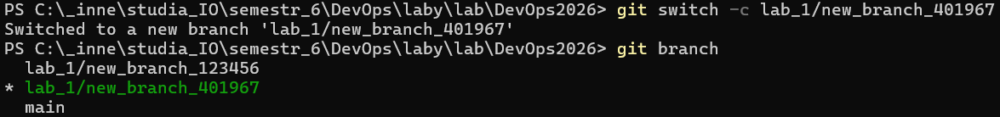
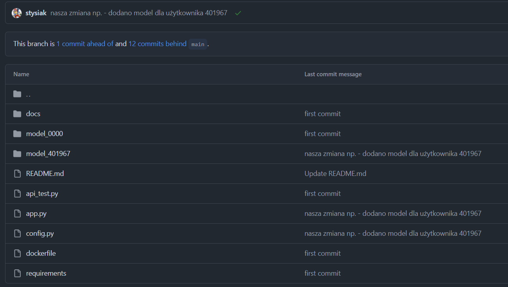
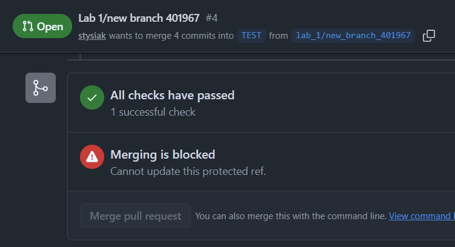

# Sprawozdanie – Lab 1

> **Autor:** 401967  
> **Data:** 2026-04-09  
> **Repozytorium:** git@github.com:Tomzonkal/DevOps2026.git

---

## Weryfikacja działania

Poniżej screenshoty potwierdzające że zadanie zostało wykonane poprawnie.

### Screenshot 1 – Aktywna gałąź robocza



Widać gwiazdkę przy `lab_1/new_branch_401967` – oznacza to że jesteśmy na właściwej gałęzi roboczej.

### Screenshot 2 – Kod widoczny na GitHubie



Po przełączeniu na gałąź `lab_1/new_branch_401967` widoczny jest folder `model_4019676` oraz zmodyfikowane pliki `app.py` i `config.py`.

### Screenshot 3 – Testy w pull requeście przeszły



Wszystkie testy GitHub Actions są zielone, co potwierdza że endpoint `/api/model_401967` działa poprawnie.

---

## Opis komend i efektów

Poniżej opisałam każdą komendę której użyłam podczas laboratorium, w kolejności w jakiej je wykonywałam.

---

### Krok 1 – Dodanie klucza SSH do konta GitHub

```bash
ssh-keygen -t ed25519 -C "jkozub@student.agh.edu.pl"
cat ~/.ssh/id_ed25519.pub
```

Pierwsza komenda generuje parę kluczy algorytmem Ed25519. W katalogu `~/.ssh/` pojawiają się dwa pliki: `id_ed25519` (klucz prywatny, zostaje na komputerze) oraz `id_ed25519.pub` (klucz publiczny, który wgrywamy na GitHuba).

Wygenerowany klucz publiczny dodajemy na GitHubie: **Settings → SSH and GPG keys → New SSH key**. Od tej chwili Git nie będzie pytał o hasło przy każdym `push` i `pull`.

---

### Krok 2 – Pobranie repozytorium

```bash
git clone git@github.com:Tomzonkal/DevOps2026.git
cd DevOps2026
```

Komenda `git clone` pobiera repozytorium na dysk lokalny wraz z całą historią commitów i wszystkimi gałęziami. Powstaje katalog `DevOps2026/` z plikami projektu i folderem `.git/` przechowującym metadane Gita.

---

### Krok 3 – Stworzenie gałęzi roboczej

```bash
cd Lab_1
git switch -c lab_1/new_branch_401967
```

Tworzy nową gałąź i od razu na nią przechodzi. Kolejne commity trafiają tutaj – nie ruszamy gałęzi `main`. Prefix `lab_1/` to konwencja nazewnicza pomagająca odróżnić gałęzie różnych laboratoriów.

---

### Krok 4 – Weryfikacja aktywnej gałęzi

```bash
git branch
```

Listuje lokalne gałęzie. Gwiazdka (`*`) przy nazwie oznacza że jesteśmy we właściwym miejscu. Oczekiwany wynik:

```
  main
* lab_1/new_branch_401967
```

---

### Krok 5 – Skopiowanie folderu modelu

```bash
cp -r model_0000 model_401967
```

Kopiujemy cały folder szablonu do nowego katalogu `model_401967`. Folder zawiera `model.py` z logiką predykcji oraz gotowy plik `model.pkl` z wytrenowanym modelem scikit-learn. Pliku `model.pkl` nie zmieniamy.

---

### Krok 6 – Edycja `model_401967/model.py`

Zmieniamy nazwę funkcji z `run_model_0000` na `run_model_401967`:

```python
# Przed:
def run_model_0000(input):

# Po:
def run_model_401967(input):
```

Zmiana nazwy zapobiega kolizji importów z funkcjami innych studentów w `app.py`.

---

### Krok 7 – Edycja `config.py`

```python
id_list = [
    "0000",
    "401967"   # ← dodajemy swój numer indeksu
]
```

Plik `config.py` jest odczytywany przez `api_test.py`. Pytest używa `@pytest.mark.parametrize` żeby automatycznie wygenerować osobny test dla każdego ID z listy. Bez tego wpisu test się w ogóle nie uruchomi.

---

### Krok 8 – Edycja `app.py`

Dodajemy import na górze pliku (za istniejącymi importami):

```python
from model_401967 import model as model_401967
```

Następnie kopiujemy całą definicję funkcji `model_00000_input` wraz z dekoratorem i wklejamy ją poniżej, zmieniając nazwy na nasze:

```python
@app.route('/api/model_401967', methods=['POST'])
def model_401967_input():
    data = request.get_json()
    input = data["input"]
    result = model_401967.run_model_401967(input=input)
    return jsonify({'result': result}), 200
```

Dekorator `@app.route` rejestruje funkcję jako handler HTTP dla ścieżki `/api/model_401967`. Flask mapuje przychodzące requesty na odpowiednie funkcje na podstawie URL i metody HTTP.

---

### Krok 9 – Staging zmian i konfiguracja Gita

Jeśli Git nie był wcześniej skonfigurowany, ustawiamy dane autora:

```bash
git config --global user.email "jkozub@student.agh.edu.pl"
git config --global user.name "stysiaczek"
```

Następnie dodajemy zmienione pliki do strefy staging:

```bash
git add *
```

Podawanie konkretnych plików (zamiast `*`) daje pewność że commitujemy tylko to co chcemy. Uwaga: `git add *` pomija pliki zaczynające się od kropki (np. `.env`).

---

### Krok 10 – Tworzenie commita

```bash
git commit -m "dodano model dla użytkownika 401967"
```

Zapisuje snapshot ze staging do lokalnej historii Gita. Na tym etapie zmiany istnieją wyłącznie lokalnie – nie są jeszcze widoczne na GitHubie.

---

### Krok 11 – Push

```bash
git push --set-upstream origin lab_1/new_branch_401967
```

Wysyła gałąź na GitHuba i ustawia tracking branch. Kolejne `git push` w tej gałęzi nie będą wymagać podawania pełnej nazwy.

---

### Krok 12 – Weryfikacja na GitHubie i pull request

1. Wchodzimy na stronę repo na GitHubie.
2. Przełączamy selektor gałęzi na `lab_1/new_branch_401967` i sprawdzamy czy nasze pliki są widoczne.
3. Zakładka **Pull requests → New pull request**.
4. Ustawiamy: **base:** `TEST`, **compare:** `lab_1/new_branch_401967`.
5. Klikamy **Create pull request**.

GitHub Actions automatycznie odpala pytest po utworzeniu PR. Jeśli wszystkie testy są zielone – zadanie jest zaliczone.

---

## Podsumowanie

W tym laboratorium przeszłam przez kompletny cykl pracy z repozytorium Git w środowisku GitHub:

1. **Skonfigurowanie SSH** – żeby nie wpisywać hasła przy każdym pushu.
2. **Sklonowanie repo i stworzenie gałęzi** – każdy student pracuje na swoim kodzie bez nadpisywania cudzych zmian.
3. **Commit i push** – ważne żeby rozumieć różnicę między lokalnym zapisem (`commit`) a wysłaniem na serwer (`push`).
4. **Pull request i CI** – automatyczne testy przez pytest i GitHub Actions to podstawa współczesnego developmentu.

Całość ilustruje **GitHub Flow**: krótka gałąź → commit → push → pull request → testy → merge.