# Wstęp
Celem ćwiczenia było zapoznanie się z podstawowymi komendami gita i używaniem go do tworzenia gałęzi, commitów, wypychania zmian (push) i tworzenia pull requestów.
# Przebieg Ćwiczeń
Pierwszym krokiem będzie utworzenie klucza SSH i dodanie go do swojego konta GitHub.
Klucz SSH (Secure Shell) to cyfrowy sposób potwierdzania tożsamości w sieci o wysokim
standardzie bezpieczeństwa. Dzięki dodaniu go do swojego konta GitHub można połączyć je
razem ze swoim komputerem, co ułatwia korzystanie z gita, ponieważ dzięki temu nie jest
wymagane ciągłe podawanie swoich danych.
W git bash klucz SSH można wygenerować komendą:
```
ssh-keygen -t ed25519 -C "email@przyklad.com"
```
Po wykonaniu tego powinny wygenerować się klucze prywatny i publiczny w folderze
użytkownika. Publiczny klucz można dodać do swojego konta GitHub można pod adresem:
https://github.com/settings/keys .
Przed sklonowaniem repozytorium należy jeszcze uruchomić agenta SSH:
```
eval "$(ssh-agent -s)"
```
Następnie dodać klucz do agenta:
```
ssh-add ~/.ssh/plik_z_kluczem_prywatnym
```
Później sklonować repozytorium można za pomocą komendy:
```
git clone git@github.com:nazwa-uzytkownika/nazwa-repozytorium.git
```
Po sklonowaniu repozytorium, kolejnym krokiem będzie utworzenie własnej gałęzi i przejście do niej:

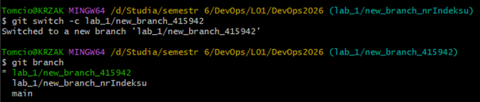

Następnie w katalogu „Lab_1” kopiujemy folder „model_0000”. Kopii nadajemy nazwę z własnym
indeksem:

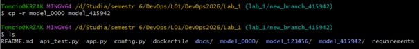

Kolejno w pliku „config.py” dodajemy stringa z indeksem do listy „id_list”. Osobiście używam do tego
edytora Nano w git bash:

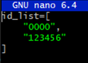
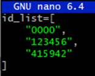

Teraz wchodzimy do folderu z naszym indeksem i otwieramy plik „model.py”. Zmieniamy w nim nazwę
funkcji, tak aby pasowała do naszego indeksu:

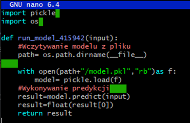

Następnie zajmiemy się edycją „app.py” w „Lab_1”. Na początku pliku dodajemy linijkę:
```
from model_nrNaszegoIndeksu import model as model_nrNaszegoIndeksu
```

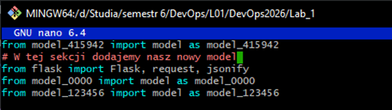

Oraz dodajemy kopię funkcji zmienioną tak, aby jej struktura odpowiadała naszemu indeksowi:

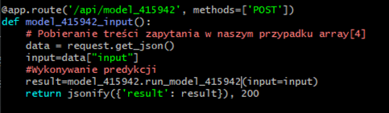

Teraz należy zająć się zaktualizowaniem zmian, tak aby zsynchronizowały się z serwerem GitHuba.
Trzeba dodać wykonane zmiany do nowego commita, czyli zapisu stanu projektu. Następnie trzeba
utworzyć tego commita z krótkim opisem wprowadzonych zmian:

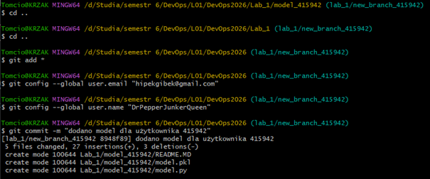

Teraz wypychamy tego commita wskazując przy tym gałąź na której pracujemy:

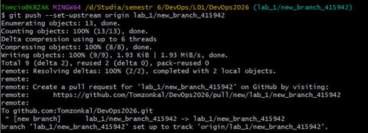

Końcowym krokiem będzie wykonanie pull requesta. Wchodzimy więc na witrynę repozytorium i
wybieramy opcję „compare & pull request”

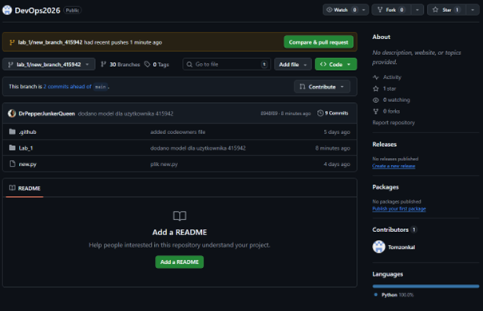

Następnie wybieramy naszą gałąź oraz gałąź do której chcemy dokonać pull requesta, czyli „TEST”. Po
potwierdzelu pull requesta powinna pokazać nam się strona z informacją, że wszystkie testy przeszły
poprawnie:

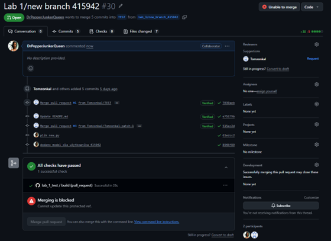

Teraz jedynie oczekujemy na merge’a od właściciela repozytorium.
# Wnioski
Udało nam się zrealizować główny cel ćwiczeń, jakim było zapoznanie się w praktyce z podstawowymi
komendami systemu git. Dodatkowo wykorzystaliśmy także wiedzę o komendach bash z innych
przedmiotów, aby wprowadzić zmiany w plikach oraz ich strukturze z poziomu terminala git bash. Poza
tym skonfigurowaliśmy klucz SSH i dodaliśmy go do konta na GitHub, co pokazało, jak można ułatwić
i zabezpieczyć autoryzację bez konieczności powtarzania podawania tych samych danych.


