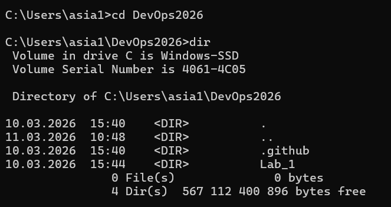
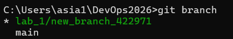
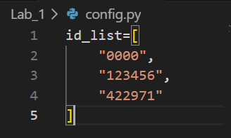
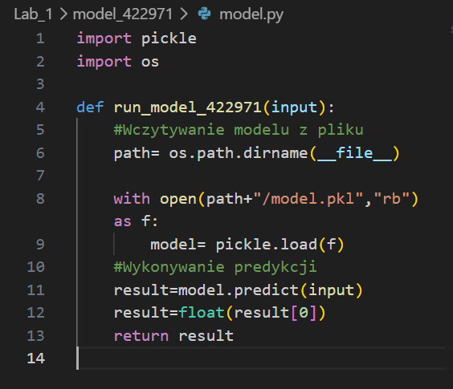
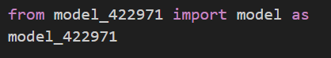
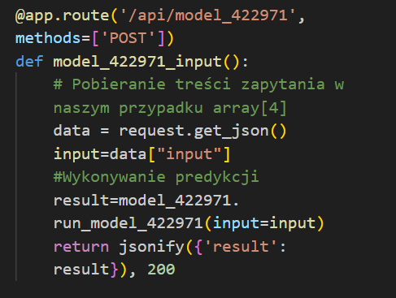
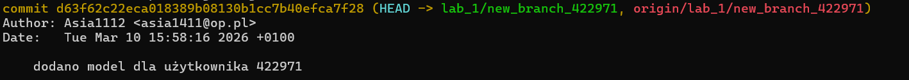
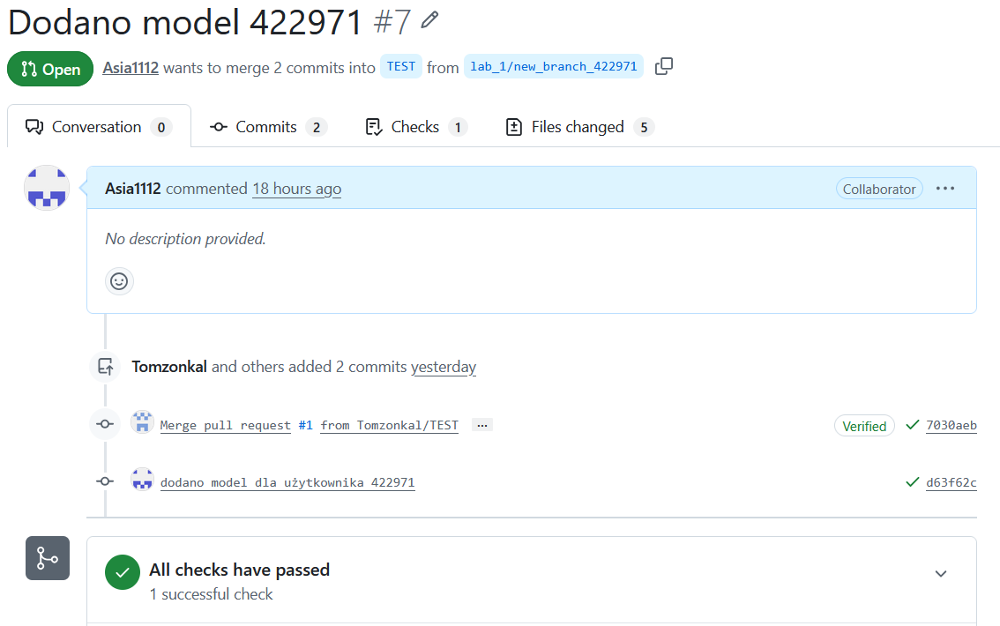

# 1. Klonowanie repozytorium

Pierwszym krokiem było pobranie repozytorium z GitHuba na komputer lokalny przy użyciu komendy:

```bash
git clone git@github.com:Tomzonkal/DevOps2026.git
```
Następnie przejście do katalogu projektu:
```bash
cd DevOps2026
```
Repozytorium po klonowaniu:



# 2. Utworzenie nowej gałęzi

Aby pracować nad własnym rozwiązaniem, należało utworzyć nową gałąź projektu:
```bash
git checkout -b lab_1/new_branch_422971
```
Sprawdzono  aktualną gałąź:
```bash
git branch
```
Wynik komendy git branch:



Gałąź oznaczona symbolem * jest aktualnie używana.

# 3. Modyfikacja kodu projektu

## 3.1 Skopiowanie modelu

W katalogu `Lab_1` skopiowano folder `model_0000`
i zmieniono jego nazwę na
`model_422971`

## 3.2. Edycja pliku config.py

W pliku `config.py` do listy `id_list` dodano numer indeksu:



Lista ta zawiera identyfikatory dostępnych modeli.

W folderze `model_422971` zmieniono nazwę funkcji:



# 4. Integracja modelu z aplikacją
## 4.1. Import modelu
Na początku pliku `app.py` dodano import:


## 4.2 Dodanie endpointu API
Skopiowano funkcję obsługującą model `model_0000` wraz z dekoratorem `@app.route` i zmieniono nazwę na `model_422971`:



# 5. Dodanie zmian do repozytorium

Po wykonaniu zmian należało dodać pliki do systemu Git.
```bash
git add *
```
# 6. Utworzenie commita
Commit zapisuje zmiany w historii repozytorium. Użyto komendy:
```bash
git commit -m "Dodano model dla użytkownika 422971"
```

Commit zawiera:

- zmienione pliki


- opis zmian


- autora


- datę wykonania zmiany

# 7. Wysłanie zmian do repozytorium zdalnego
Zmiany zostały wysłane na serwer GitHub poleceniem:
```bash
git push --set-upstream origin lab_1/new_branch_422971
```
# 8. Utworzenie Pull Request
Na stronie repozytorium utworzono Pull Requesta.
W ustawieniach wybrano:

`BASE -> TEST`

`COMPARE -> lab_1/new_branch_422971`

Pull Request umożliwia połączenie naszej gałęzi z gałęzią `TEST`


# 9. Weryfikacja zadania
Po utworzeniu Pull Requesta uruchomione zostały testy automatyczne. Wszystkie testy zakończyły się powodzeniem.



# Tematy dodatkowe

## Czym się różni `git fetch` od `git pull`

- `git fetch` pobiera zmiany z repozytorium zdalnego, ale ich nie scala z aktualną gałęzią.
Pozwala to sprawdzić zmiany przed ich wprowadzeniem do projektu.

- `git pull` pobiera zmiany oraz automatycznie scala je z aktualną gałęzią.

## Różnica między `Local Repository` a `Remote Repository`

- `Local repository` to repozytorium lokalne, które znajduje się na komputerze użytkownika i zawiera całą historię projektu.
Operacje wykonywane lokalnie:
```bash
git add
git commit
git branch
```
- `Remote repository` to repozytorium zdalne, które znajduje się na serwerze (np. GitHub) i służy do współpracy wielu użytkowników.
Operacje dotyczące repozytorium zdalnego:
```bash
git push
git pull
git fetch
```
## Czym różni się `gitflow` a `GitHub flow`
`GitFlow` jest bardziej rozbudowanym modelem pracy z repozytorium.
Wykorzystuje wiele gałęzi:
- main

- develop

- feature

- release

- hotfix

Model ten jest często stosowany w dużych projektach.

`GitHub Flow` jest prostszym modelem pracy.
Proces wygląda następująco:

1. utworzenie nowej gałęzi

2. wprowadzenie zmian

3. utworzenie Pull Request

4. scalanie zmian z gałęzią główną

## Czemu używa się `release branchy`

`Release branch` to gałąź używana do przygotowania nowej wersji oprogramowania.
Jej zadania:

- stabilizacja kodu

- poprawa błędów

- przygotowanie wersji produkcyjnej

- testowanie finalnej wersji

Dzięki temu możliwe jest dalsze rozwijanie projektu na innych gałęziach bez wpływu na przygotowywaną wersję.


