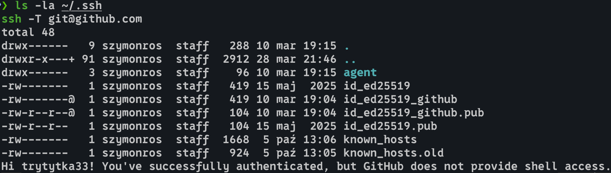
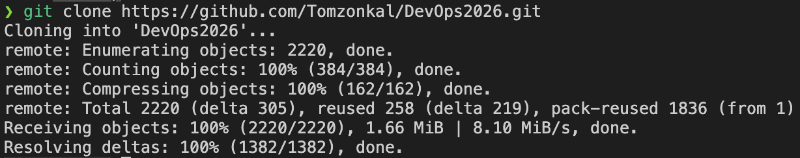
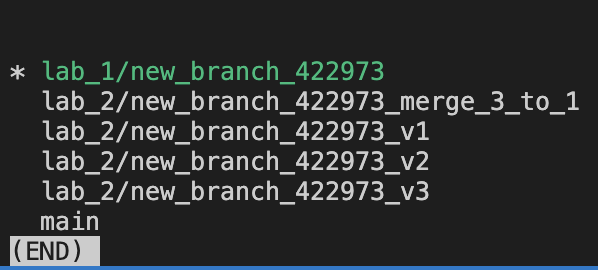
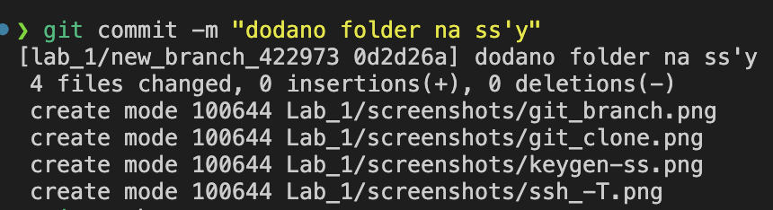
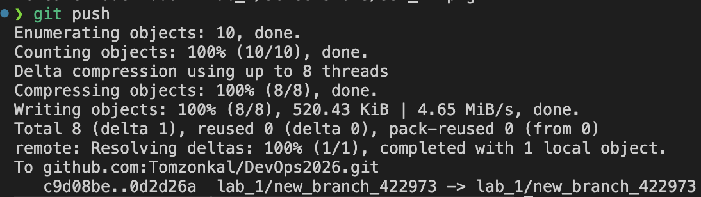
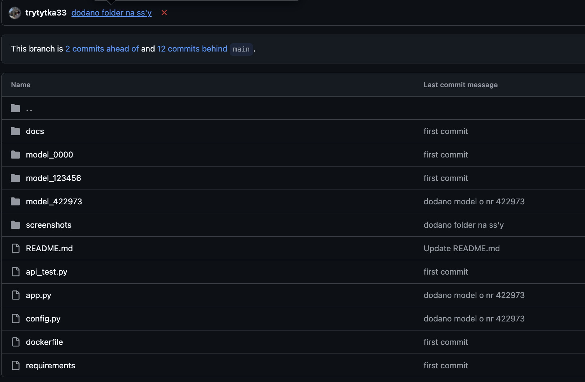
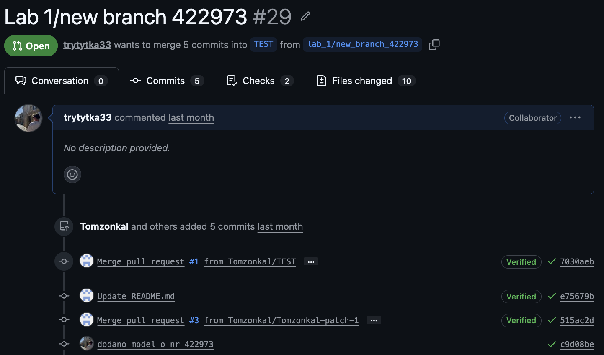
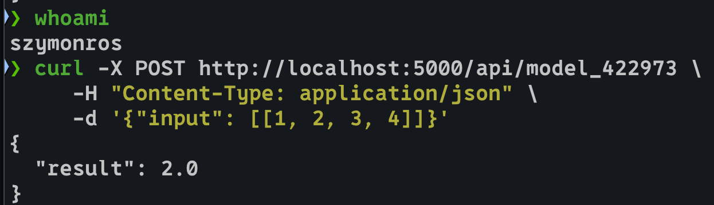
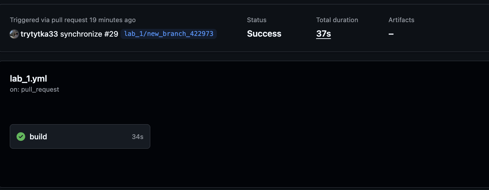

# Sprawozdanie – Lab 1

> **Autor:** 422973  
> **Data:** 2026-04-03  
> **Repozytorium:** git@github.com:Tomzonkal/DevOps2026.git

---

## Overview

Celem laboratorium było zapoznanie się z podstawowym workflow Gita i GitHuba. Zadanie polegało na sklonowaniu repozytorium, stworzeniu własnej gałęzi, dodaniu nowego endpointu do aplikacji Flask z modelem ML, a następnie wypchnięciu zmian i weryfikacji przez pipeline CI.

---

## Prerequisites

| Wymaganie | Minimalna wersja | Jak sprawdzić |
|-----------|-----------------|---------------|
| Git | 2.35+ | `git --version` |
| Python | 3.9+ | `python --version` |
| pip | 23+ | `pip --version` |
| Konto GitHub | – | dostęp do repo kursu |
| Klucz SSH w GitHubie | – | [docs.github.com](https://docs.github.com/en/authentication/connecting-to-github-with-ssh) |

Wymagane biblioteki Python:
```
flask
scikit-learn
pytest
requests
```

---

## Step-by-step guide

### Krok 1 – Konfiguracja klucza SSH

```bash
ssh-keygen -t ed25519 -C "szymonros195@gmail.com"
cat ~/.ssh/id_ed25519.pub
```

Wygenerowałem parę kluczy SSH algorytmem Ed25519. Klucz publiczny (`id_ed25519.pub`) wgrałem na GitHuba w **Settings → SSH and GPG keys → New SSH key**. Dzięki temu przy każdym `push`/`pull` nie trzeba podawać hasła.

Poprawność konfiguracji można sprawdzić komendą:
```bash
ssh -T git@github.com
```

w

---

### Krok 2 – Klonowanie repozytorium

```bash
git clone git@github.com:Tomzonkal/DevOps2026.git
cd DevOps2026
```

Komenda pobiera całe repozytorium wraz z historią commitów. W katalogu `Lab_1/` znajduje się bazowa aplikacja Flask z przykładowym modelem `model_0000`, który posłużył jako szablon.



---

### Krok 3 – Stworzenie gałęzi roboczej

```bash
git switch -c lab_1/new_branch_422973
git push --set-upstream origin lab_1/new_branch_422973
```

Nowa gałąź izoluje moje zmiany od kodu innych osób pracujących na tym samym repo. Od razu wypchnąłem ją na serwer żeby była widoczna na GitHubie.

```bash
git branch
```



---

### Krok 4 – Skopiowanie folderu modelu

```bash
cp -r model_0000 model_422973
```

Skopiowałem cały folder szablonu zamiast tworzyć pliki od zera. Folder zawiera `model.py` z logiką predykcji oraz `model.pkl` – wytrenowany model w formacie pickle. Pliku `model.pkl` nie modyfikowałem.

```
Lab_1/
├── model_0000/
│   ├── model.pkl
│   └── model.py
└── model_422973/
    ├── model.pkl
    └── model.py
```

---

### Krok 5 – Edycja `model_422973/model.py`

Zmieniłem nazwę funkcji z `run_model_0000` na `run_model_422973`:

```python
import pickle
import os

def run_model_422973(input):
    path = os.path.dirname(__file__)
    with open(path + "/model.pkl", "rb") as f:
        model = pickle.load(f)
    result = model.predict(input)
    result = float(result[0])
    return result
```

Wynik `predict()` jest konwertowany do `float` bo scikit-learn zwraca tablicę numpy, która nie serializuje się poprawnie do JSON. `os.path.dirname(__file__)` zapewnia że ścieżka do `model.pkl` działa niezależnie od tego z jakiego katalogu uruchamiamy aplikację.

---

### Krok 6 – Edycja `config.py`

```python
id_list = [
    "0000",
    "422973"
]
```

Dodałem swój numer indeksu do listy `id_list`. Na jej podstawie pytest generuje testy dla każdego studenta – bez tego wpisu test w ogóle się nie odpala.

---

### Krok 7 – Edycja `app.py`

Na górze pliku dodałem import:
```python
from model_422973 import model as model_422973
```

Następnie skopiowałem istniejącą funkcję endpointu i dostosowałem ją do swojego modelu:
```python
@app.route('/api/model_422973', methods=['POST'])
def model_422973_input():
    data = request.get_json()
    input = data["input"]
    result = model_422973.run_model_422973(input=input)
    return jsonify({'result': result}), 200
```

Dekorator `@app.route` rejestruje nowy endpoint POST w Flasku. `request.get_json()` parsuje ciało requestu jako JSON i przekazuje dane do modelu.

---

### Krok 8 – Commit i push

```bash
git add config.py app.py model_422973/model.py
git commit -m "dodano model dla użytkownika 422973"
git push
```

Najpierw dodałem konkretne pliki do stagingu, potem stworzyłem commita lokalnie i wypchnąłem go na serwer. Commit zapisuje zmiany tylko lokalnie – `push` synchronizuje je z GitHubem.




> Screenshot przedstawia push folderu `screenshots/`. Output dla commita z modelem wyglądałby analogicznie – różni się tylko treść commita i hash.

---

### Krok 9 – Weryfikacja i pull request

Wszedłem na stronę repo na GitHubie, przełączyłem widok na gałąź `lab_1/new_branch_422973` i potwierdziłem że moje pliki są widoczne.

Następnie w zakładce **Pull requests** stworzyłem nowy PR:
- **base:** `TEST`
- **compare:** `lab_1/new_branch_422973`

Po utworzeniu PR GitHub Actions automatycznie odpalił testy.





---

## Expected output

### Test manualny endpointu

```bash
curl -X POST http://localhost:5000/api/model_422973 \
     -H "Content-Type: application/json" \
     -d '{"input": [[1, 2, 3, 4]]}'
```
```json
{"result": 2.0}
```



### Wynik pytest

```
collected 2 items

api_test.py::test_api_models[0000] PASSED
api_test.py::test_api_models[422973] PASSED

====== 2 passed in 0.42s ======
```



---

## Tematy dodatkowe

### git fetch vs git pull

`git fetch` pobiera zmiany ze zdalnego repo, ale nie rusza lokalnych plików – trafiają do remote-tracking branches (np. `origin/main`). Można wtedy spokojnie zobaczyć co się zmieniło zanim cokolwiek zmergujemy.

`git pull` robi to samo co `fetch`, ale od razu scala zmiany z aktualną gałęzią. Wygodniejsze przy samodzielnej pracy, ale w zespole lepiej najpierw sprawdzić co przyszło przez `fetch`.

---

### Local repository vs Remote repository

**Local repository**  na naszym komputerze w folderze `.git/` – wszystkie operacje jak `commit` czy `branch` działają offline.

**Remote repository** to wersja na serwerze (GitHub) – służy do współdzielenia kodu z innymi i jako backup. `push` wysyła nasze commity na serwer, `pull`/`fetch` pobiera cudze zmiany do nas.

---

### Gitflow vs GitHub Flow

**Gitflow** operuje na kilku równoległych gałęziach: `main`, `develop`, `feature/*`, `release/*`, `hotfix/*`. Każda ma swoją rolę i zasady mergowania. Pasuje do projektów z regularnie wydawanymi, wersjonowanymi releasami.

**GitHub Flow** to uproszczona wersja – jest tylko `main` i krótkotrwałe gałęzie feature mergowane przez PR. Sprawdza się przy ciągłym deploymencie gdzie kod w `main` jest zawsze produkcyjny i nie ma sensu trzymać osobnego `develop`.

---

### Po co używa się release branchy

Release branch (np. `release/1.2.0`) odgałęzia się od `develop` gdy kod jest gotowy do wydania. Na tej gałęzi robi się już tylko bugfixy i ostatnie poprawki, a `develop` idzie dalej z nowymi ficzerami – nie blokujemy sobie nawzajem pracy.

Po wydaniu tagujemy commit w `main` (np. `v1.2.0`) co pozwala w każdej chwili wrócić do dokładnego stanu kodu z tamtego momentu. Umożliwia też serwisowanie starszych wersji przez hotfixy bez ruszania aktualnego kodu.

---

## Podsumowanie

Laboratorium przeprowadziło przez pełny cykl pracy z Gitem: konfiguracja SSH → klonowanie → gałąź robocza → zmiany w kodzie → commit i push → pull request → weryfikacja przez CI. Dobrze ilustruje to GitHub Flow w praktyce – każda zmiana idzie przez osobną gałąź i pull request z automatycznymi testami.