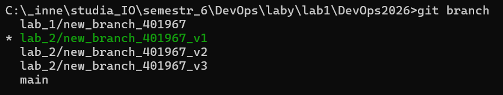
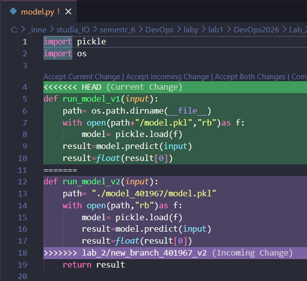
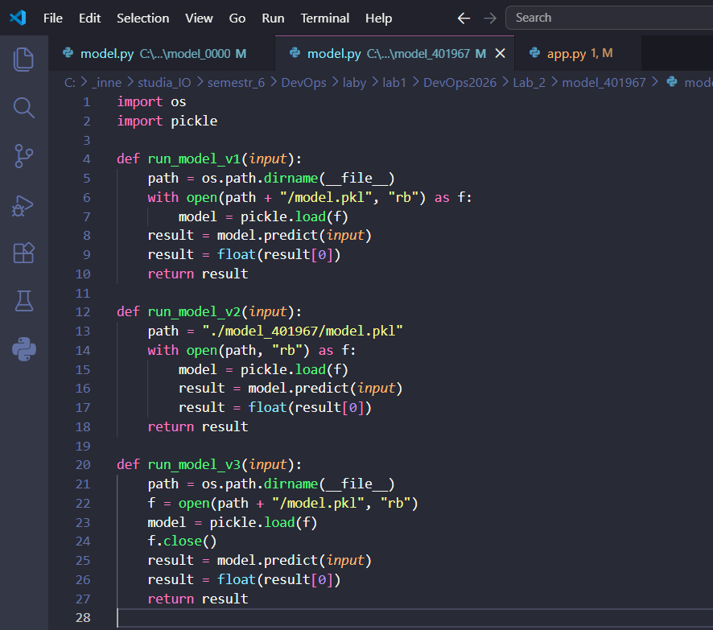
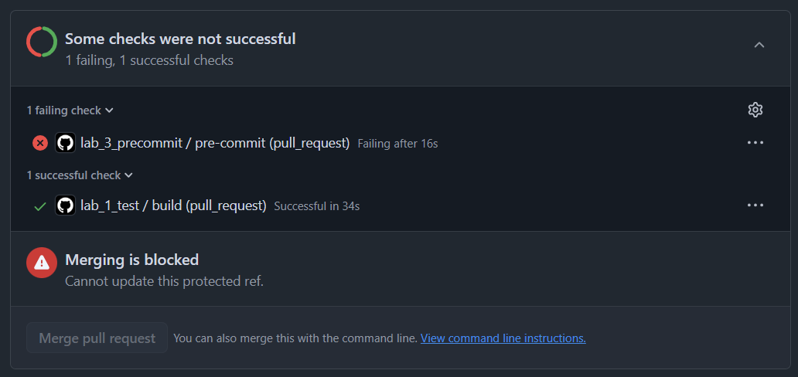

# Sprawozdanie – Lab 2

> **Autor:** 401967  
> **Data:** 2026-04-09  
> **Repozytorium:** git@github.com:Tomzonkal/DevOps2026.git

---

## Ocena 3 – Weryfikacja działania

Poniżej screenshoty potwierdzające że zadanie zostało wykonane poprawnie.

### Screenshot 1 – Trzy gałęzie robocze widoczne w terminalu



Widoczne są wszystkie cztery gałęzie robocze: `lab_2/new_branch_401967_v1`, `lab_2/new_branch_401967_v2` oraz `lab_2/new_branch_401967_v3`.

### Screenshot 2 – Rozwiązane konflikty w pliku `model.py`



Po zmergowaniu v2 do v1 plik `model.py` zawiera obie wersje funkcji. Konflikty zostały rozwiązane ręcznie w lokalnym środowisku.

### Screenshot 3 – Trzy wersje po mergu z branchem pomocniczym



Po wykorzystaniu brancha pomocniczego `merge_3_to_1` plik `model.py` zawiera już trzy wersje funkcji.

### Screenshot 4 – Testy w pull requeście przeszły



Test GitHub Actions są zielone, co potwierdza poprawność działania endpointów (PR nie przeszedł testu precommit, ze względu na brak poprawności plików z folderu Lab_1 i Lab_3).

---

## Ocena 4 – Opis komend i efektów

### Krok 1 – Aktualizacja repozytorium

```bash
git fetch --all
git checkout main
git pull
```

`git fetch --all` pobiera metadane wszystkich zdalnych gałęzi bez modyfikowania lokalnych plików – dzięki temu Git wie o wszystkich zmianach na serwerze. `git checkout main` przełącza na gałąź `main`, a `git pull` pobiera i scala najnowsze zmiany z serwera do lokalnej kopii.

---

### Krok 2 – Stworzenie trzech gałęzi roboczych

```bash
git switch -c lab_2/new_branch_401967_v1
git push
```

```bash
git switch -c lab_2/new_branch_401967_v2
git push
```

```bash
git switch -c lab_2/new_branch_401967_v3
git push
```

Każda komenda tworzy nową gałąź i od razu ją pushuje na serwer. Trzy oddzielne gałęzie reprezentują trzy niezależne wersje rozwiązania – celowo zawierają zmiany w tych samych liniach kodu, co wywoła konflikty przy mergowaniu.

---

### Krok 3 – Edycja poszczególnych gałęzi

Na każdej gałęzi wykonujemy analogiczne kroki:

1. Kopiujemy folder `model_0000` do `model_401967` (tylko raz, na v1).
2. W pliku `model_401967/model.py` zostawiamy tylko jedną funkcję przypisaną do danej wersji:

**Wersja 1 (`v1`):**
```python
def run_model_v1(input):
    path = os.path.dirname(__file__)
    with open(path + "/model.pkl", "rb") as f:
        model = pickle.load(f)
    result = model.predict(input)
    result = float(result[0])
    return result
```

**Wersja 2 (`v2`):**
```python
def run_model_v2(input):
    path = "./model_401967/model.pkl"
    with open(path, "rb") as f:
        model = pickle.load(f)
        result = model.predict(input)
        result = float(result[0])
    return result
```

**Wersja 3 (`v3`):**
```python
def run_model_v3(input):
    path = os.path.dirname(__file__)
    f = open(path + "/model.pkl", "rb")
    model = pickle.load(f)
    f.close()
    result = model.predict(input)
    result = float(result[0])
    return result
```

> **Ważne:** Funkcje muszą zajmować dokładnie te same linie w pliku – bez dodatkowych odstępów. Tylko wtedy merge wywoła konflikt, który trzeba będzie rozwiązać ręcznie.

W pliku `app.py` dodajemy import i endpoint dla każdej wersji (analogicznie jak w Lab 1, z nazwą odpowiednią do wersji). W `config.py` dodajemy `"401967"` do listy `id_list`.

Następnie commitujemy i pushujemy każdą wersję:

```bash
git checkout lab_2/new_branch_401967_v1
git add *
git commit -m "zrobiono wersje 1"
git push
```

Powtarzamy dla v2 i v3 (zmieniając nazwę gałęzi i treść commita).

---

### Krok 4 – Mergowanie v2 do v1 (bezpośredni merge)

```bash
git switch lab_2/new_branch_401967_v1
git merge lab_2/new_branch_401967_v2
```

Przełączamy się na gałąź docelową (`v1`) i mergujemy do niej `v2`. Ponieważ obie gałęzie zmieniały te same linie w `model.py`, Git nie może automatycznie rozstrzygnąć który kod jest właściwy – powstaje **konflikt**.

#### Wygląd konfliktu w pliku

```
<<<<<<< HEAD
def run_model__v1(input):
=======
def run_model_v2(input):
>>>>>>> lab_2/new_branch_401967_v2
```

Znaczniki oznaczają:
- `<<<<<<< HEAD` – aktualny stan gałęzi docelowej (v1)
- `=======` – separator
- `>>>>>>> lab_2/new_branch_401967_v2` – kod z mergowanej gałęzi (v2)

#### Rozwiązanie konfliktu

Ręcznie edytujemy plik tak, aby zawierał **obie** funkcje (usuwamy znaczniki konfliktu i zostawiamy kod obu wersji). Następnie w `app.py` upewniamy się że endpoint wywołuje predykcję dwukrotnie – raz dla v1, raz dla v2.

Po rozwiązaniu konfliktu zatwierdzamy merge:

```bash
git add *
git commit -m "zmergowano v2 do v1, rozwiązano konflikty"
git push
```

---

### Krok 5 – Mergowanie v3 przez branch pomocniczy

Przy skomplikowanych merge'ach warto utworzyć dedykowany branch pomocniczy, na którym iteracyjnie rozwiązujemy konflikty – nie ryzykując przy tym uszkodzenia gałęzi docelowej.

#### 5.1 – Utworzenie brancha pomocniczego z v1

```bash
git checkout lab_2/new_branch_401967_v1
git switch -c lab_2/new_branch_401967_merge_3_to_1
git push
```

Nowy branch `merge_3_to_1` startuje ze stanem v1 po poprzednim mergu (zawiera już funkcje v1 i v2).

#### 5.2 – Merge v3 do brancha pomocniczego

```bash
git checkout lab_2/new_branch_401967_merge_3_to_1
git merge lab_2/new_branch_401967_v3
```

Ponownie powstaje konflikt w `model.py` – tym razem między istniejącymi funkcjami (v1 + v2) a funkcją v3.

#### 5.3 – Rozwiązanie konfliktu

Edytujemy plik tak, aby zawierał wszystkie **trzy** funkcje. W `app.py` zapewniamy że predykcja jest wywoływana trzykrotnie – dla każdej wersji osobno.

#### 5.4 – Push brancha pomocniczego

```bash
git add *
git commit -m "zmergowano 3 z 1"
git push
```

#### 5.5 – Scalenie brancha pomocniczego z v1

```bash
git checkout lab_2/new_branch_401967_v1
git merge lab_2/new_branch_401967_merge_3_to_1
git push
```

Ponieważ branch pomocniczy jest bezpośrednim potomkiem v1 (nie ma rozbieżności w historii), ten merge jest **fast-forward** – nie ma żadnych konfliktów. Gałąź v1 teraz zawiera trzy wersje modelu.

---

### Krok 6 – Pull request do gałęzi TEST

Analogicznie jak w Lab 1:

1. Wchodzimy na stronę repo na GitHubie.
2. **Pull requests → New pull request**.
3. Ustawiamy: **base:** `TEST`, **compare:** `lab_2/new_branch_401967_v1`.
4. Klikamy **Create pull request**.

GitHub Actions odpala pytest automatycznie. Zielony status wszystkich testów potwierdza poprawność działania.

---

## Podsumowanie

W tym laboratorium poznałam mechanizmy mergowania gałęzi i rozwiązywania konfliktów w Gicie:

1. **Trzy gałęzie robocze** – celowo zawierały zmiany w tych samych liniach, co prowokowało konflikty przy łączeniu.
2. **Bezpośredni merge** – szybkie połączenie v2 z v1 z ręcznym rozwiązaniem konfliktu w lokalnym środowisku.
3. **Branch pomocniczy** – bezpieczniejsze podejście do skomplikowanych merge'ów: konflikty rozwiązujemy na izolowanym branchu, a do gałęzi docelowej trafia już gotowy, przetestowany kod bez nowych konfliktów.
4. **Pull request i CI** – automatyczne testy weryfikują że wszystkie endpointy po mergach działają poprawnie.