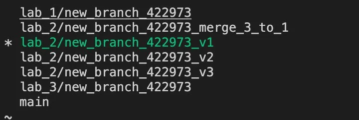
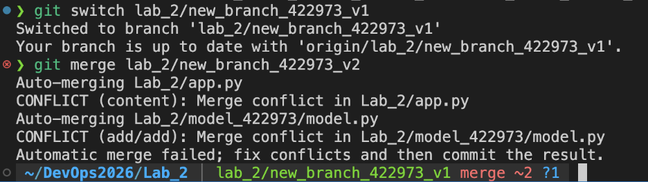
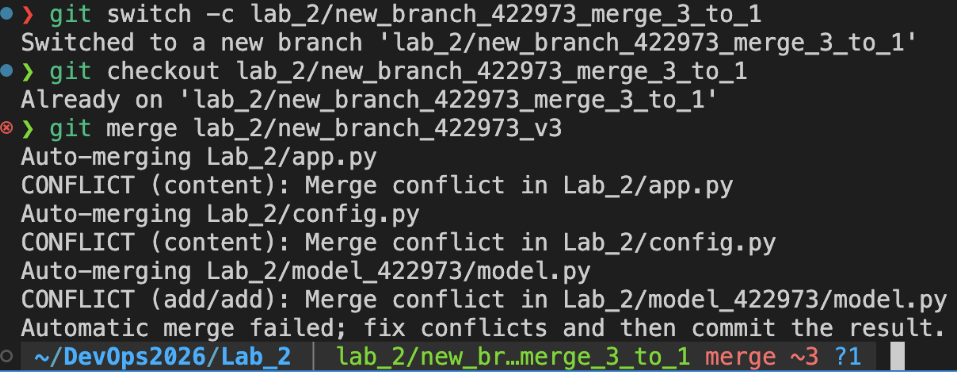

# Sprawozdanie – Lab 2

> **Autor:** 422973  
> **Data:** 2026-04-09  
> **Repozytorium:** git@github.com:Tomzonkal/DevOps2026.git

---

## Overview

Celem laboratorium było zapoznanie się z mergowaniem gałęzi i rozwiązywaniem konfliktów. Zadanie polegało na stworzeniu trzech wersji rozwiązania na osobnych branchach, a następnie połączeniu ich w jedną gałąź – najpierw bezpośrednim mergem, potem przez branch pomocniczy.

---

## Prerequisites

| Wymaganie | Minimalna wersja | Jak sprawdzić |
|-----------|-----------------|---------------|
| Git | 2.35+ | `git --version` |
| Python | 3.9+ | `python --version` |
| Konto GitHub | – | dostęp do repo kursu |

---

## Step-by-step guide

### Krok 1 – Aktualizacja repo

```bash
git fetch --all
git checkout main
git pull
```

---

### Krok 2 – Stworzenie trzech gałęzi roboczych

```bash
git switch -c lab_2/new_branch_422973_v1
git push --set-upstream origin lab_2/new_branch_422973_v1

git switch -c lab_2/new_branch_422973_v2
git push --set-upstream origin lab_2/new_branch_422973_v2

git switch -c lab_2/new_branch_422973_v3
git push --set-upstream origin lab_2/new_branch_422973_v3
```

Każda wersja dostaje osobną gałąź – dzięki temu zmiany są od siebie odizolowane i można je później mergować z kontrolowanymi konfliktami.



---

### Krok 3 – Edycja poszczególnych gałęzi

Na każdej gałęzi skopiowałem folder `model_0000` do `model_422973` i zostawiłem tylko jedną funkcję – każda wersja ma inną implementację tej samej logiki. Dzięki temu przy merge te same linie kodu będą się różnić i wywołają konflikty.

**v1 – `run_model_v1`** używa `os.path.dirname(__file__)` i `with open`:
```python
def run_model_v1(input):
    path= os.path.dirname(__file__)
    with open(path+"/model.pkl","rb")as f:
        model= pickle.load(f)
    result=model.predict(input)
    result=float(result[0])
    return result
```

**v2 – `run_model_422973_v2`** używa stałej ścieżki:
```python
def run_model_422973_v2(input):
    path= "./model_0000/model.pkl"
    with open(path,"rb")as f:
        model= pickle.load(f)    
        result=model.predict(input)
        result=float(result[0])
    return result
```

**v3 – `run_model_422973_v3`** używa `os.path.dirname` i ręcznego `f.close()`:
```python
def run_model_422973_v3(input):
    path= os.path.dirname(__file__)
    f=open(path+"/model.pkl","rb")
    model= pickle.load(f)
    f.close()
    result=model.predict(input)
    result=float(result[0])
    return result
```

W `app.py` i `config.py` dodałem odpowiednie importy i endpointy dla każdej wersji, a następnie zcommitowałem i wypchnąłem każdy branch.

---

### Krok 4 – Merge v2 do v1 (bezpośredni)

```bash
git switch lab_2/new_branch_422973_v1
git merge lab_2/new_branch_422973_v2
```

Pojawił się konflikt w `model.py` i `app.py` – git nie wiedział którą wersję funkcji zachować. Widać to po znacznikach `<<<<<<<`, `=======`, `>>>>>>>` w plikach.



Rozwiązałem konflikt przez **Accept Both Changes** w VSCode dla `model.py` – chciałem żeby obie funkcje zostały w pliku. W `app.py` ręcznie złożyłem dwa endpointy. Po rozwiązaniu:

```bash
git add Lab_2/app.py Lab_2/model_422973/model.py
PRE_COMMIT_ALLOW_NO_CONFIG=1 git commit -m "zmergowano v2 do v1"
git push
```


---

### Krok 5 – Merge v3 przez branch pomocniczy

Dla trzeciego merge zamiast robić go bezpośrednio na v1, użyłem brancha pomocniczego. Chodzi o to żeby nie niszczyć działającego kodu na v1 podczas rozwiązywania potencjalnie skomplikowanych konfliktów – merge testuje się na bocznym branchu, a do v1 trafia już gotowy, działający kod.

```bash
git checkout lab_2/new_branch_422973_v1
git switch -c lab_2/new_branch_422973_merge_3_to_1
git push --set-upstream origin lab_2/new_branch_422973_merge_3_to_1
```

```bash
git checkout lab_2/new_branch_422973_merge_3_to_1
git merge lab_2/new_branch_422973_v3
```

Znowu konflikty – tym razem w `model.py`, `app.py` i `config.py`.



Przy rozwiązywaniu konfliktu w `model.py` przez Accept Both Changes VSCode zgubił trzecią funkcję – zostały tylko dwie. Musiałem dopisać `run_model_422973_v3` ręcznie. Przy `app.py` też zastąpiłem cały plik ręcznie żeby nie zostały znaczniki konfliktu. To jest normalny proces rozwiązywania konfliktu – decydujesz jak ma wyglądać finalny kod.

Po rozwiązaniu:

```bash
git add Lab_2/app.py Lab_2/model_422973/model.py Lab_2/config.py
PRE_COMMIT_ALLOW_NO_CONFIG=1 git commit -m "zmergowano v3 do merge_3_to_1"
git push
```

Następnie zmergowałem branch pomocniczy do v1:

```bash
git checkout lab_2/new_branch_422973_v1
git merge lab_2/new_branch_422973_merge_3_to_1
git push
```

---

### Finalny stan `model.py` po wszystkich merge'ach

```python
import pickle
import os

###### Pierwsze rozwiązanie ##########

def run_model_v1(input):
    path= os.path.dirname(__file__)
    with open(path+"/model.pkl","rb")as f:
        model= pickle.load(f)
    result=model.predict(input)
    result=float(result[0])
    return result

###### Drugie rozwiązanie ##########

def run_model_422973_v2(input):
    path= "./model_0000/model.pkl"
    with open(path,"rb")as f:
        model= pickle.load(f)    
        result=model.predict(input)
        result=float(result[0])
    return result

####### Trzecie rozwiązanie ###########

def run_model_422973_v3(input):
    path= os.path.dirname(__file__)
    f=open(path+"/model.pkl","rb")
    model= pickle.load(f)
    f.close()
    result=model.predict(input)
    result=float(result[0])
    return result
```

### Finalny stan `app.py`

```python
from flask import Flask, request, jsonify
from model_0000 import model
from model_422973 import model as model_422973

app = Flask(__name__)

@app.route('/api/model_v1', methods=['POST'])
def model_v1_input():
    data = request.get_json()
    input = data["input"]
    result_v1 = model.run_model_v1(input)
    return jsonify({'result': result_v1}), 200

@app.route('/api/model_422973', methods=['POST'])
def model_422973_input():
    data = request.get_json()
    input = data["input"]
    result_v1 = model_422973.run_model_422973_v2(input)
    return jsonify({'result': result_v1}), 200

@app.route('/api/model_422973_input', methods=['POST'])
def model_422973_v3_input():
    data = request.get_json()
    input = data["input"]
    result_v1 = model_422973.run_model_422973_v3(input)
    return jsonify({'result': result_v1}), 200

if __name__ == '__main__':
    app.run(host="0.0.0.0", debug=True, port=5000)
```

---

### Krok 6 – Pull request do TEST

Stworzyłem PR z **base:** `TEST`, **compare:** `lab_2/new_branch_422973_v1`.


---

## Tematy dodatkowe

### Dlaczego mergowanie z branchem pomocniczym nie wywołuje konfliktów

Kiedy mergujemy `merge_3_to_1` do `v1`, git widzi że `merge_3_to_1` powstał z `v1` i zawiera już rozwiązane konflikty. Z perspektywy gita to jest po prostu "dorzucenie kilku commitów" które już są spójne z historią `v1`. Konflikty były rozwiązane na branchu pomocniczym, więc przy finalnym merge do `v1` git nie musi ponownie ich rozstrzygać – dostaje gotowy, bezkonfiktowy kod.

---

### Ile jest rodzajów merge w gicie

Git ma trzy główne strategie merge:

**Fast-forward** – najprostszy przypadek. Jeśli branch docelowy nie miał żadnych nowych commitów od momentu rozgałęzienia, git po prostu przesuwa wskaźnik HEAD do przodu. Nie tworzy dodatkowego merge commita – historia wygląda jakby praca była prowadzona liniowo.

**Recursive (3-way merge)** – domyślna strategia gdy oba branche miały nowe commity. Git szuka wspólnego przodka obu gałęzi i porównuje zmiany – jeśli te same linie były zmieniane na obu branchach, pojawia się konflikt do ręcznego rozwiązania.

**Squash merge** – wszystkie commity z mergowanego brancha są spłaszczane do jednego commita. Przydatne gdy chcemy zachować czystą historię i nie chcemy żeby drobne commity z feature brancha zaśmiecały `main`.

---

### Jak zarządzać projektem żeby unikać zbędnych konfliktów

Główna zasada to trzymanie krótkich, skupionych gałęzi – im dłużej branch żyje osobno, tym więcej zmian akumuluje `main` i tym więcej konfliktów przy merge. Kilka praktycznych zasad:

Regularnie mergować lub rebase'ować `main` do swojego brancha – dzięki temu konflikty rozwiązuje się małymi porcjami na bieżąco zamiast jednego dużego konfliktu na końcu. Podzielić pracę między developerów tak żeby ruszali różne pliki lub różne moduły – konflikty pojawiają się gdy dwie osoby edytują te same linie. Utrzymywać małe PR-y które szybko trafiają do `main` zamiast długo żyjących feature branchy. Ustalić konwencje formatowania kodu (np. przez pre-commit hooks jak w lab_3) żeby nie dochodziło do konfliktów spowodowanych różnicami w stylach.

---

## Podsumowanie

Laboratorium pokazało jak działają konflikty w gicie i dwa sposoby ich rozwiązywania. Bezpośredni merge jest szybszy ale ryzykowny przy skomplikowanych zmianach. Branch pomocniczy daje więcej kontroli – konflikty rozwiązuje się w bezpiecznym miejscu bez ruszania głównej gałęzi, a dopiero potem gotowy kod trafia do celu.