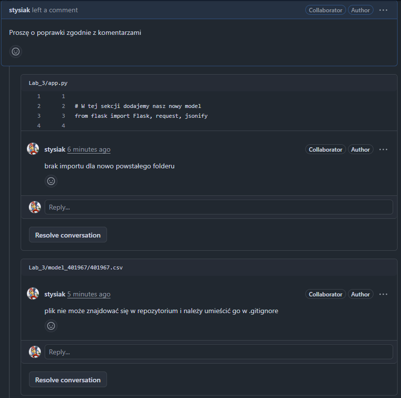
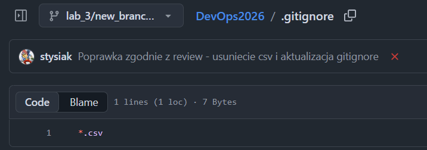
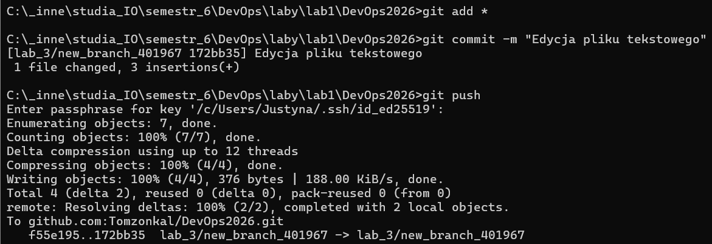
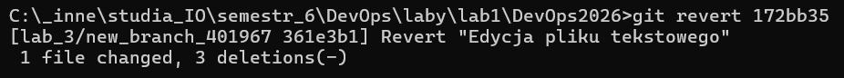
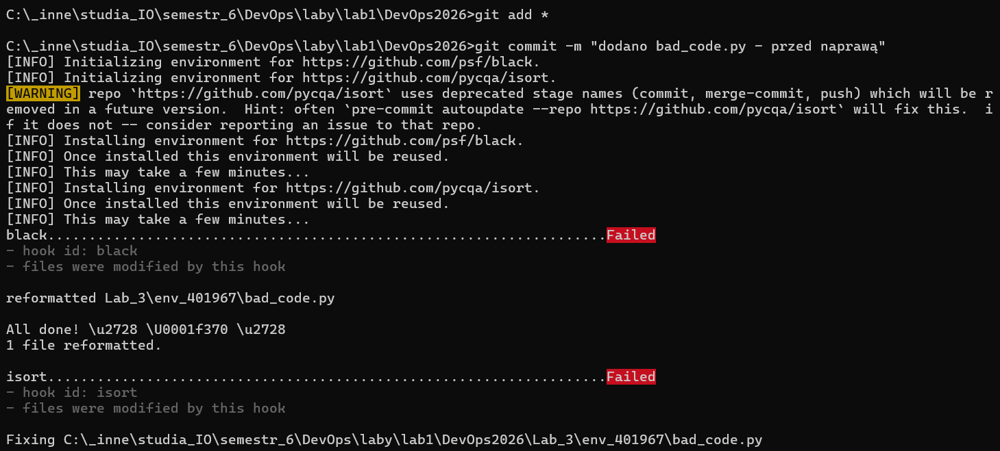
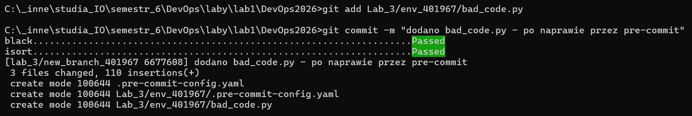

# Sprawozdanie – Lab 3

> **Autor:** 401967  
> **Data:** 2026-04-09  
> **Repozytorium:** git@github.com:Tomzonkal/DevOps2026.git

---

## Ocena 3 – Weryfikacja działania

### Screenshot 1 – Code review z komentarzami



Dodane komentarze: brak importu dla nowego folderu w `app.py` oraz uwaga że plik `.csv` nie powinien znajdować się w repozytorium i należy go umieścić w `.gitignore`.

### Screenshot 2 – Stan po poprawkach (.gitignore, .gitkeep)



Plik `.csv` usunięty z repozytorium, dodany wpis `*.csv` do `.gitignore`.

### Screenshot 3 – Revert commita




Widoczny commit `revert` cofający zmiany z kroku 6.1. Plik `test_plik.txt` po rewertowaniu wrócił do wersji z commita 6.1.

### Screenshot 4 – Pre-commit hooks blokują commit



Pierwszy commit pliku `bad_code.py` nie przeszedł – hooki `black` i `isort` automatycznie zmodyfikowały plik.

### Screenshot 5 – Drugi commit przechodzi pomyślnie



Po dodaniu poprawionego pliku drugi commit przeszedł bez problemów.

---

## Ocena 4 – Opis komend i efektów

### Krok 1 – Aktualizacja repozytorium

```bash
git fetch --all
git checkout main
git pull
```

`git fetch --all` pobiera metadane wszystkich zdalnych gałęzi bez modyfikowania lokalnych plików. `git pull` pobiera i scala najnowsze zmiany z serwera.

---

### Krok 2 – Stworzenie gałęzi roboczej

```bash
git switch -c lab_3/new_branch_401967
git push
```

Tworzy nową gałąź i natychmiast pushuje ją na serwer, dzięki czemu jest widoczna na GitHubie od razu.

---

### Krok 3 – Dodanie folderu modelu i pliku CSV

```bash
git checkout lab_3/new_branch_401967
git add *
git commit -m "dodano plik csv do nowego folderu z modelem"
git push
```

Stworzono folder `Lab_3/model_401967/` i umieszczono w nim plik `401967.csv`. Celowo zły commit – plik CSV nie powinien trafiać do repozytorium, co zostanie wychwycone w code review.

---

### Krok 4 – Code review

Dla tego commita utworzono pull request do gałęzi `TEST`.

W zakładce **Files changed** uruchomiono tryb **Review**:

- Do linijki importów w `app.py` dodano komentarz: *brak importu dla nowo powstałego folderu `model_401967`*.
- Do pliku `401967.csv` dodano komentarz: *plik CSV nie może znajdować się w repozytorium – należy go umieścić w `.gitignore`*.

Review zamknięto z opcją **Comment** – pull request nie został zaakceptowany, odesłano go z prośbą o poprawki.

---

### Krok 5 – Poprawka kodu

#### 5.1 – Usunięcie pliku CSV z repozytorium

```bash
git rm 401967.csv
```

`git rm` usuwa plik zarówno z dysku jak i ze śledzenia przez Gita. Sam `rm` usunąłby tylko plik lokalnie, a Git nadal by go śledził.

#### 5.2 – Dodanie wpisu do `.gitignore`

Do pliku `.gitignore` dodano linię:

```
*.csv
```

Od tej chwili wszystkie pliki z rozszerzeniem `.csv` będą ignorowane przez `git add *` i nie trafią do kolejnych commitów.

#### 5.3 – Dodanie nowego pliku CSV i `.gitkeep`

Do folderu `model_401967/` dodano:
- `nowy_401967.csv` – żeby zweryfikować że `.gitignore` działa (plik nie powinien zostać dodany przez `git add *`)
- `.gitkeep` – pusty plik wymuszający że Git zapamięta pusty katalog; Git nie śledzi pustych folderów, dlatego stosuje się tę konwencję

```bash
git add *
git commit -m "usunieto csv, dodano gitignore i gitkeep"
git push
```

---

### Krok 6 – Naprawa repozytorium przez git revert

#### 6.1 – Dodanie pliku testowego

Stworzono plik `test_plik.txt` z przykładową treścią i wykonano commit:

```bash
git add test_plik.txt
git commit -m "dodano test_plik.txt"
git push
```

#### 6.2 i 6.3 – Weryfikacja i edycja pliku

Plik jest widoczny w pull requeście. Następnie plik edytowano i wypushowano kolejny commit ze zmianami.

#### 6.4 – Revert do commita z kroku 6.1

```bash
git revert hash_commita
```

`git revert` tworzy **nowy commit**, który odwraca zmiany wprowadzone przez wskazany commit. Nie usuwa historii – stary commit nadal jest widoczny w logu. To kluczowa różnica względem `git reset`, który usuwa commit z historii.

`hash_commita` to identyfikator commita z kroku 6.1 – można go odczytać z `git log`.

#### 6.5 – Rozwiązanie konfliktów i push

Przy rewertowaniu mogą pojawić się konflikty (jeśli plik był edytowany po commicie 6.1). Po ich ręcznym rozwiązaniu:

```bash
git add *
git commit -m "revert - cofnięto zmiany z test_plik.txt"
git push
```

Weryfikacja na GitHubie: plik `test_plik.txt` wrócił do stanu z commita 6.1.

---

### Krok 7 – Pre-commit hooks

#### 7.1 – Instalacja narzędzia pre-commit

```bash
pip install pre-commit
pre-commit --version
```

`pre-commit` to narzędzie zarządzające hookami Gita. Hooki to skrypty uruchamiane automatycznie w określonych momentach pracy z Gitem – w tym przypadku przed każdym commitem.

#### 7.2 – Skopiowanie folderu środowiska

```bash
cp -r Lab_3/env_0000 Lab_3/env_401967
```

#### 7.3 – Instalacja hooków w lokalnym repozytorium

```bash
pre-commit install
```

Komenda tworzy skrypt w `.git/hooks/pre-commit`, który będzie wywoływany automatycznie przy każdym `git commit`. Konfiguracja hooków (jakie narzędzia uruchamiać) zawarta jest w pliku `.pre-commit-config.yaml` w repozytorium.

#### 7.4 – Próba commita zepsutego pliku

```bash
git add Lab_3/env_401967/bad_code.py
git commit -m "dodano bad_code.py - przed naprawą"
```

Commit nie przeszedł. Hooki `black` (formatter kodu) i `isort` (sortowanie importów) wykryły błędy formatowania i automatycznie poprawiły plik:

```
black....................................................................Failed
- hook id: black
- files were modified by this hook

isort....................................................................Failed
- hook id: isort
- files were modified by this hook
```

Hooki **nie tylko raportują błędy – same naprawiają plik**. Commit jednak nie dochodzi do skutku, bo plik w staging różni się od tego na dysku (hook go zmodyfikował). Wymaga to ponownego `git add`.

#### 7.5 – Diff po działaniu hooków

```bash
git diff Lab_3/env_401967/bad_code.py
```

Wynik działania diff:

```diff
index 537a191..d1f70c0 100644
--- a/Lab_3/env_401967/bad_code.py
+++ b/Lab_3/env_401967/bad_code.py
@@ -1,66 +1,84 @@
+import json
+import math
 import os
 import sys
-import json
 from datetime import datetime
-import math


 # Zle sformatowana funkcja - brakuje spacji, zla ilosc pustych linii
-def calculate_discount(price,discount_percent):
-    if discount_percent>100:
+def calculate_discount(price, discount_percent):
+    if discount_percent > 100:
         return 0
-    if discount_percent<0:
+    if discount_percent < 0:
         return price
-    discount_amount=price*discount_percent/100
-    final_price=price-discount_amount
+    discount_amount = price * discount_percent / 100
+    final_price = price - discount_amount
     return final_price


 def get_current_timestamp():
-    now=datetime.now()
+    now = datetime.now()
     return now.strftime("%Y-%m-%d %H:%M:%S")

:...skipping...
diff --git a/Lab_3/env_401967/bad_code.py b/Lab_3/env_401967/bad_code.py
index 537a191..d1f70c0 100644
--- a/Lab_3/env_401967/bad_code.py
+++ b/Lab_3/env_401967/bad_code.py
@@ -1,66 +1,84 @@
+import json
+import math
 import os
 import sys
-import json
 from datetime import datetime
-import math


 # Zle sformatowana funkcja - brakuje spacji, zla ilosc pustych linii
-def calculate_discount(price,discount_percent):
-    if discount_percent>100:
+def calculate_discount(price, discount_percent):
+    if discount_percent > 100:
         return 0
-    if discount_percent<0:
+    if discount_percent < 0:
         return price
-    discount_amount=price*discount_percent/100
-    final_price=price-discount_amount
+    discount_amount = price * discount_percent / 100
+    final_price = price - discount_amount
     return final_price


 def get_current_timestamp():
-    now=datetime.now()
+    now = datetime.now()
     return now.strftime("%Y-%m-%d %H:%M:%S")


 # Zbyt dlugie linie i nadmiarowe spacje
-def describe_product( product_name,   price,   category  ):
-    timestamp=get_current_timestamp()
-    description="Produkt: "+product_name+"  |  Cena: "+str(price)+" PLN  |  Kategoria: "+category+"  |  Czas: "+timesta:
diff --git a/Lab_3/env_401967/bad_code.py b/Lab_3/env_401967/bad_code.py
index 537a191..d1f70c0 100644
--- a/Lab_3/env_401967/bad_code.py
+++ b/Lab_3/env_401967/bad_code.py
@@ -1,66 +1,84 @@
+import json
+import math
 import os
 import sys
-import json
 from datetime import datetime
-import math


 # Zle sformatowana funkcja - brakuje spacji, zla ilosc pustych linii
-def calculate_discount(price,discount_percent):
-    if discount_percent>100:
+def calculate_discount(price, discount_percent):
+    if discount_percent > 100:
         return 0
-    if discount_percent<0:
+    if discount_percent < 0:
         return price
-    discount_amount=price*discount_percent/100
-    final_price=price-discount_amount
+    discount_amount = price * discount_percent / 100
+    final_price = price - discount_amount
     return final_price


 def get_current_timestamp():
-    now=datetime.now()
+    now = datetime.now()
     return now.strftime("%Y-%m-%d %H:%M:%S")


 # Zbyt dlugie linie i nadmiarowe spacje
-def describe_product( product_name,   price,   category  ):
-    timestamp=get_current_timestamp()
-    description="Produkt: "+product_name+"  |  Cena: "+str(price)+" PLN  |  Kategoria: "+category+"  |  Czas: "+timestamp
+def describe_product(product_name, price, category):
+    timestamp = get_current_timestamp()
+    description = (
+        "Produkt: "
+        + product_name
+        + "  |  Cena: "
+        + str(price)
+        + " PLN  |  Kategoria: "
+        + category
+        + "  |  Czas: "
+        + timestamp
+    )
     return description


 class ProductCatalog:
-    def __init__(self,name):
-        self.name=name
-        self.products=[]
-
-    def add_product(self,product_name,price,category):
-        product={"name":product_name,"price":price,"category":category,"added_at":get_current_timestamp()}
+    def __init__(self, name):
+        self.name = name
+        self.products = []
+
+    def add_product(self, product_name, price, category):
+        product = {
+            "name": product_name,
+            "price": price,
+            "category": category,
+            "added_at": get_current_timestamp(),
+        }
         self.products.append(product)

-    def get_cheapest( self ):
+    def get_cheapest(self):
         if not self.products:
             return None
-        cheapest=min(self.products,key=lambda p:p["price"])
+        cheapest = min(self.products, key=lambda p: p["price"])
         return cheapest

-    def to_json( self ):
-        return json.dumps({"catalog":self.name,"products":self.products},indent=2,ensure_ascii=False)
+    def to_json(self):
+        return json.dumps(
+            {"catalog": self.name, "products": self.products},
+            indent=2,
+            ensure_ascii=False,
+        )


 def main():
-    catalog=ProductCatalog("Sklep testowy")
-    catalog.add_product("Laptop",3499.99,"Elektronika")
-    catalog.add_product("Kawa",24.99,"Spozywcze")
-    catalog.add_product("Ksiazka",39.90,"Edukacja")
+    catalog = ProductCatalog("Sklep testowy")
+    catalog.add_product("Laptop", 3499.99, "Elektronika")
+    catalog.add_product("Kawa", 24.99, "Spozywcze")
+    catalog.add_product("Ksiazka", 39.90, "Edukacja")

     print(catalog.to_json())

-    cheapest=catalog.get_cheapest()
-    print("Najtanszy produkt:",cheapest["name"],"za",cheapest["price"],"PLN")
+    cheapest = catalog.get_cheapest()
+    print("Najtanszy produkt:", cheapest["name"], "za", cheapest["price"], "PLN")

-    discounted=calculate_discount(cheapest["price"],15)
-    print("Po rabacie 15%:",round(discounted,2),"PLN")
+    discounted = calculate_discount(cheapest["price"], 15)
+    print("Po rabacie 15%:", round(discounted, 2), "PLN")


-if __name__=="__main__":
+if __name__ == "__main__":
     main()
```

`black` dodał spacje przy operatorach, poprawił wcięcia i usunął zbędne spacje w nawiasach. `isort` posortował importy alfabetycznie i rozdzielił je na osobne linie.

#### 7.6 – Drugi commit po naprawie

```bash
git add Lab_3/env_401967/bad_code.py
git commit -m "dodano bad_code.py - po naprawie przez pre-commit"
```

Tym razem commit przeszedł pomyślnie. Hooki uruchomiły się ponownie, ale nie znalazły już nic do naprawy – plik był już zgodny ze standardem.

```
black....................................................................Passed
isort....................................................................Passed
```

**Dlaczego drugi commit przeszedł?** Po pierwszej próbie hooki zmodyfikowały plik tak, żeby spełniał wymagania formatowania. Po ponownym `git add` staging zawierał już poprawioną wersję. Przy drugim commicie hooki nie miały co naprawiać – plik był czysty.

---

## Podsumowanie

W tym laboratorium poznałam trzy niezależne zagadnienia DevOps:

1. **Code review** – komentowanie pull requestów, zgłaszanie problemów z kodem (plik CSV w repozytorium, brakujący import) i odsyłanie do poprawek. Code review to podstawa pracy zespołowej – pozwala wychwycić błędy zanim trafią do głównej gałęzi.

2. **Git revert** – bezpieczne cofanie zmian przez stworzenie nowego commita odwracającego wskazany. Historia repozytorium pozostaje nienaruszona, co jest kluczowe w pracy zespołowej.

3. **Pre-commit hooks** – automatyczne narzędzia formatujące kod przed każdym commitem. Hooki `black` i `isort` wymuszają jednolity styl w całym projekcie bez ręcznej interwencji programisty. Pierwszy commit blokowany jest dlatego, że hook modyfikuje plik – drugi przechodzi bo plik jest już poprawny.