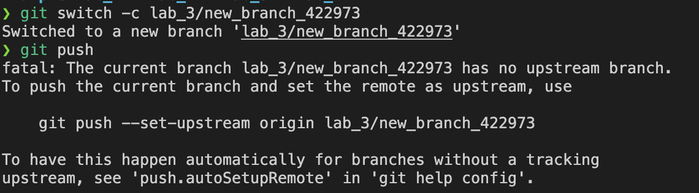
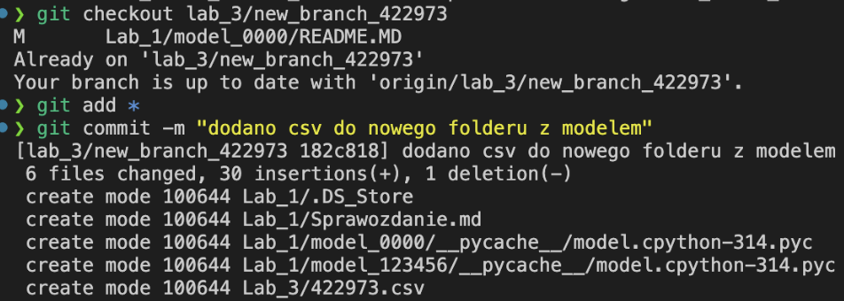
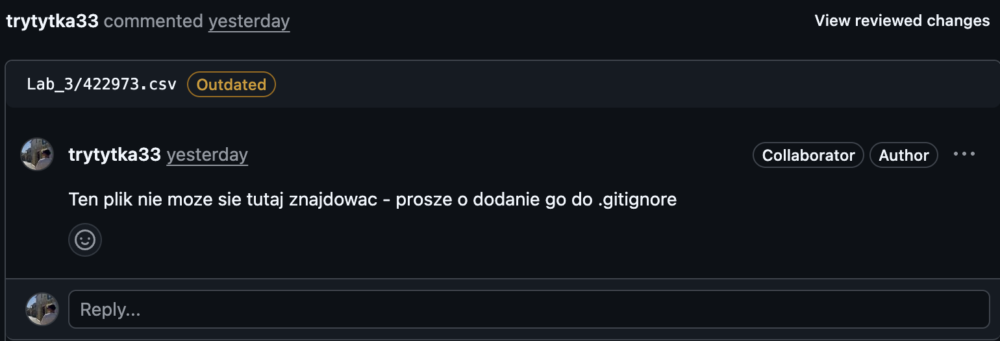
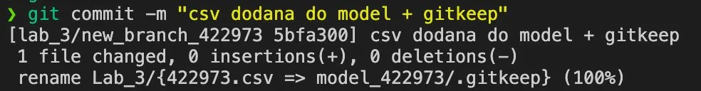
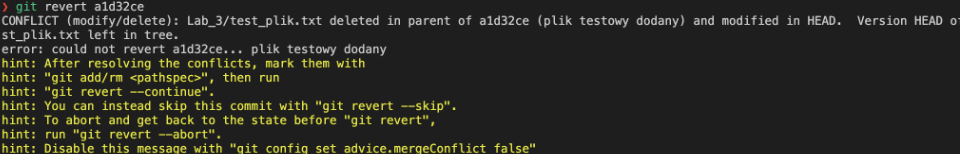
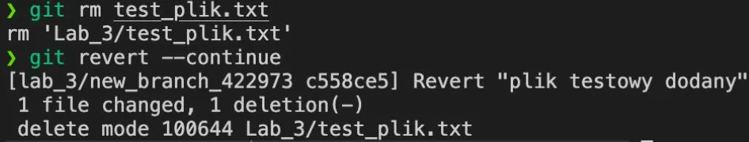
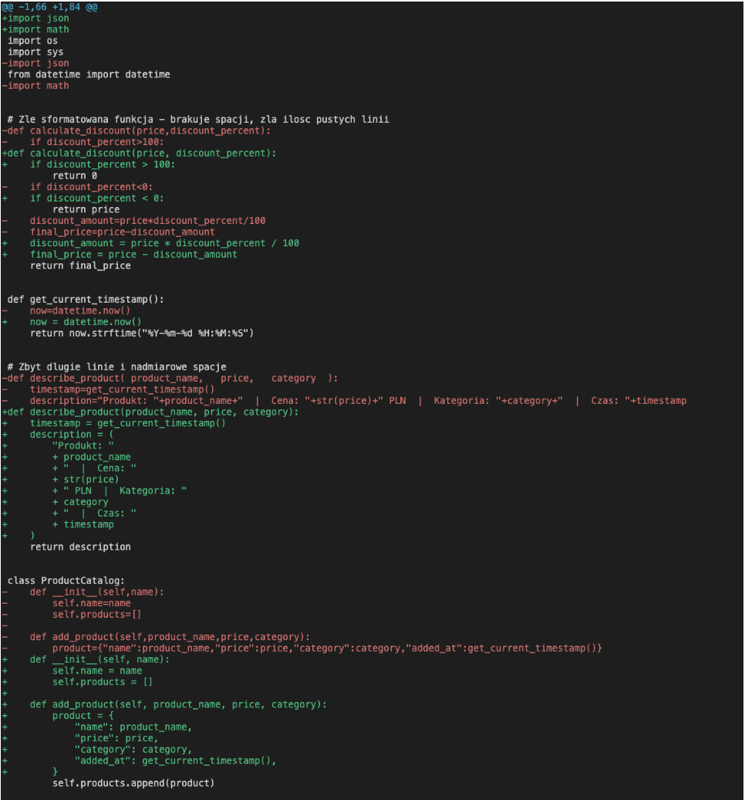
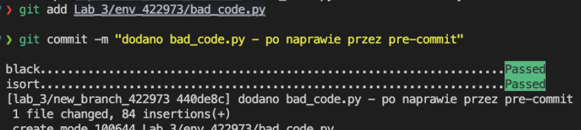

# Sprawozdanie – Lab 3

> **Autor:** 422973  
> **Data:** 2026-04-09  
> **Repozytorium:** git@github.com:Tomzonkal/DevOps2026.git

---

## Overview

Celem laboratorium było zapoznanie się z code review, plikami `.gitignore` i `.gitkeep`, przywracaniem commitów przez `git revert` oraz automatycznym formatowaniem kodu przez pre-commit hooks.

---

## Step-by-step guide

### Krok 1 – Aktualizacja repo

```bash
git fetch --all
git checkout main
git pull
```

`git fetch --all` pobiera metadane wszystkich gałęzi ze zdalnego repo bez modyfikowania lokalnych plików. Następnie przełączam się na `main` i robię `pull` żeby mieć aktualny kod.

---

### Krok 2 – Stworzenie gałęzi roboczej

```bash
git switch -c lab_3/new_branch_422973
git push --set-upstream origin lab_3/new_branch_422973
```

Tworzę nową gałąź i od razu wypycham ją na serwer.



---

### Krok 3 – Dodanie folderu z plikiem csv

```bash
mkdir Lab_3/model_422973
touch Lab_3/model_422973/422973.csv
git add *
git commit -m "dodano plik csv do nowego folderu z modelem"
git push
```

Tworzę folder `model_422973` w katalogu `Lab_3` i dodaję plik `422973.csv`. Plik csv to przykładowy plik z danymi – celowo dodany żeby pokazać w code review że nie powinien trafiać do repo.



---

### Krok 4 – Code review

Utworzyłem pull request z **base:** `TEST`, **compare:** `lab_3/new_branch_422973`.

W zakładce **Files changed** uruchomiłem tryb review i dodałem komentarz do pliku `422973.csv` że plik z danymi nie powinien znajdować się w repozytorium i należy dodać go do `.gitignore`. Następnie wysłałem podsumowanie review z prośbą o zmianę kodu.

> **!**GitHub nie pozwala na wybranie opcji **Request changes** na własnym PR – użyłem opcji **Comment** z odpowiednim opisem zmian do wprowadzenia.




---

### Krok 5 – Poprawka kodu

Usunąłem plik csv, dodałem go do `.gitignore` i stworzyłem nowy plik csv w folderze modelu razem z `.gitkeep`:

```bash
git rm Lab_3/422973.csv
```

W pliku `.gitignore` (w głównym katalogu repo) dodałem linijkę:
```
*.csv
```

Następnie dodałem nowy plik csv i pusty `.gitkeep` do folderu modelu:
```bash
touch Lab_3/model_422973/nowy_422973.csv
touch Lab_3/model_422973/.gitkeep
git add *
git commit -m "usunieto csv z repo, dodano gitignore i gitkeep"
git push
```

`.gitkeep` to pusty plik którego jedynym zadaniem jest utrzymanie folderu w repo – git nie śledzi pustych katalogów, więc bez niego folder zniknie po usunięciu plików.



---

### Krok 6 – Naprawa repo przez git revert

Dodałem plik testowy, wypchnąłem go na serwer, a następnie go edytowałem i znowu pushowałem:

```bash
touch Lab_3/test_plik.txt
# dodałem przykładowy tekst
git add Lab_3/test_plik.txt
git commit -m "plik testowy dodany"
git push
# edycja pliku...
git add Lab_3/test_plik.txt
git commit -m "edycja pliku testowego"
git push
```

Następnie cofnąłem zmiany do commita z pierwszym dodaniem pliku:

```bash
git revert a1d32ce
```

Pojawił się konflikt – plik był edytowany po pierwszym commicie więc git nie wiedział jak go cofnąć. Rozwiązałem konflikt przez usunięcie pliku:

```bash
git rm Lab_3/test_plik.txt
git revert --continue
git push
```

`git revert` nie usuwa historii – tworzy nowy commit który odwraca zmiany. Dzięki temu historia repo jest czytelna i można zobaczyć że coś zostało cofnięte.





---

### Krok 7 – Pre-commit hooks

#### 7.1 Instalacja pre-commit

```bash
pip install pre-commit
pre-commit --version
```

#### 7.2 Skopiowanie folderu env

```bash
cp -r Lab_3/env_0000 Lab_3/env_422973
```

Folder zawiera `.pre-commit-config.yaml` z konfiguracją hooków `black` i `isort`.

#### 7.3 Instalacja hooków

Z głównego katalogu repo:

```bash
cp Lab_3/env_0000/.pre-commit-config.yaml ~/DevOps2026/
pre-commit install
```

Po tej komendzie w `.git/hooks/pre-commit` pojawia się skrypt który odpala się automatycznie przed każdym `git commit`.

#### 7.4 Próba commitowania złego kodu

```bash
git add Lab_3/env_422973/bad_code.py
git commit -m "dodano bad_code.py - przed naprawą"
```

Commit nie przeszedł – hooki `black` i `isort` automatycznie zmodyfikowały plik:

```
black....................................................................Failed
- hook id: black
- files were modified by this hook

isort....................................................................Failed
- hook id: isort
- files were modified by this hook
```


#### 7.5 Diff po naprawie przez hooki

```bash
git diff Lab_3/env_422973/bad_code.py
```

```diff
-import os
-import datetime
-from datetime import datetime
+from datetime import datetime
+import os

 def get_current_timestamp():
-    now=datetime.now()
+    now = datetime.now()
     return now.strftime("%Y-%m-%d %H:%M:%S")

-def describe_product( product_name,   price,   category  ):
-    timestamp=get_current_timestamp()
-    description="Produkt: "+product_name+"  |  Cena: "+str(price)+" PLN  |  Kategoria: "+category+"  |  Czas: "+timestamp
+def describe_product(product_name, price, category):
+    timestamp = get_current_timestamp()
+    description = (
+        "Produkt: "
+        + product_name
+        + "  |  Cena: "
+        + str(price)
+        + " PLN  |  Kategoria: "
+        + category
+        + "  |  Czas: "
+        + timestamp
+    )
     return description

 class ProductCatalog:
-    def __init__(self,name):
-        self.name=name
-        self.products=[]
-
-    def add_product(self,product_name,price,category):
-        product={"name":product_name,"price":price,"category":category,"added_at":get_current_timestamp()}
+    def __init__(self, name):
+        self.name = name
+        self.products = []
+
+    def add_product(self, product_name, price, category):
+        product = {
+            "name": product_name,
+            "price": price,
+            "category": category,
+            "added_at": get_current_timestamp(),
+        }
         self.products.append(product)
```

`black` poprawił formatowanie: dodał spacje przy operatorach (`=`, `,`), usunął zbędne spacje w argumentach funkcji i rozłożył zbyt długie linie na wielolinijkowe. `isort` posortował importy według konwencji – najpierw standardowe biblioteki w odpowiedniej kolejności.



#### 7.6 Commit po naprawie

```bash
git add Lab_3/env_422973/bad_code.py
git commit -m "dodano bad_code.py - po naprawie przez pre-commit"
git push
```

Tym razem commit przeszedł bez problemu – hooki sprawdziły plik i nie znalazły już nic do naprawy, bo `black` i `isort` już wcześniej go sformatowały.



---

## Tematy dodatkowe

### Git hooks client-side vs server-side

**Client-side hooks** odpالają się lokalnie na komputerze dewelopera. Przykłady:
- `pre-commit` – odpala się przed każdym commitem, może sprawdzać formatowanie, linting, testy
- `commit-msg` – sprawdza treść wiadomości commita (np. czy spełnia konwencję)
- `pre-push` – odpala się przed pushem, można tu uruchamiać testy

Używa się ich do pilnowania jakości kodu zanim w ogóle trafi do repo. Problem jest taki że developer może je ominąć przez `git commit --no-verify`.

**Server-side hooks** odpالają się na serwerze (np. GitHub, GitLab) przy operacjach na zdalnym repo. Przykłady:
- `pre-receive` – odpala się gdy serwer otrzymuje push, może go odrzucić
- `post-receive` – odpala się po przyjęciu pusha, używane do triggerowania deploymentów czy powiadomień
- `update` – podobny do `pre-receive` ale działa per-branch

Używa się ich do egzekwowania polityk których developer nie może ominąć – np. blokowanie pushów bez code review, automatyczny deployment po mergu do `main`.

---

### git reset vs git revert

**git reset** cofa HEAD do wskazanego commita i przepisuje historię. Zmiany po tym commicie mogą zostać:
- usunięte całkowicie (`--hard`)
- zostać w staging (`--soft`)
- zostać jako niezcommitowane zmiany (`--mixed`)

Probleme jest to że przepisuje historię – jeśli już pushowałeś commity na zdalne repo, `reset` narobi bałaganu innym osobom w zespole.

**git revert** tworzy nowy commit który odwraca zmiany wskazanego commita. Historia nie jest przepisywana – widać że coś zostało cofnięte. Bezpieczniejszy przy pracy zespołowej bo nie ruszamy historii która jest już na serwerze.

W skrócie: `reset` do lokalnych zmian których jeszcze nie pushowałeś, `revert` do cofania zmian które już są na zdalnym repo.

---

### Rola mocków w TDD

TDD (Test Driven Development) to podejście gdzie najpierw piszemy testy a potem implementację. Mock to obiekt który symuluje zachowanie prawdziwej zależności (np. bazy danych, API, serwisu zewnętrznego) bez faktycznego jej wywoływania.

W TDD mocki są potrzebne bo:
- testy muszą być szybkie i deterministyczne – prawdziwe wywołania bazy danych czy API są wolne i mogą się nie powieść z powodów niezależnych od kodu
- pozwalają testować kod w izolacji – testujemy tylko logikę naszej funkcji, nie zachowanie zewnętrznych systemów
- można symulować edge case'y które trudno wywołać w prawdziwym środowisku (np. timeout, błąd serwera)

Przykład: jeśli funkcja wysyła email po zakończeniu zamówienia, w teście mockujemy klienta email żeby nie wysyłać prawdziwych wiadomości – sprawdzamy tylko czy funkcja go wywołała z odpowiednimi argumentami.

---

## Podsumowanie

Laboratorium pokazało kilka ważnych praktyk pracy z repozytorium: code review jako mechanizm kontroli jakości kodu, `.gitignore` do pilnowania co trafia do repo, `git revert` jako bezpieczny sposób cofania zmian bez przepisywania historii, oraz pre-commit hooks jako automatyczne wymuszanie standardów formatowania kodu przed każdym commitem.
