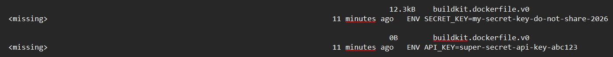
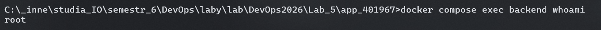
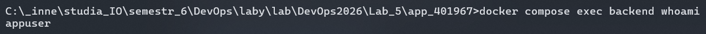
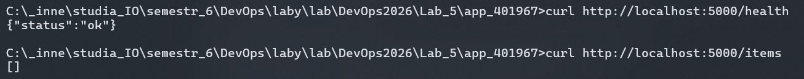
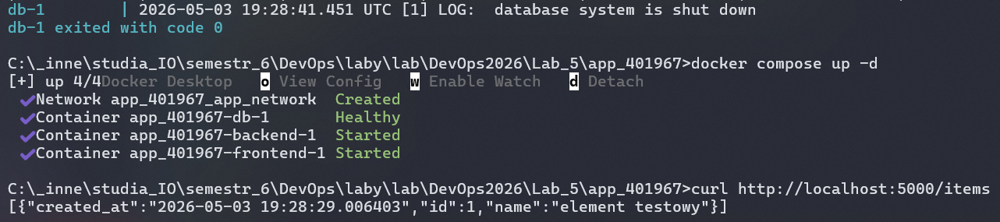

# Sprawozdanie – Lab 5

> **Autor:** 401967  
> **Data:** 2026-05-04  
> **Repozytorium:** git@github.com:Tomzonkal/DevOps2026.git

---

## Weryfikacja działania

Poniżej screenshoty potwierdzające że zadanie zostało wykonane poprawnie.

### Screenshot 1 – Sekrety widoczne w docker history przed naprawą (BŁĄD 2)



W historii warstw obrazu widoczne są wartości `API_KEY` i `SECRET_KEY` zapisane jako dyrektywy `ENV` — każdy kto posiada obraz może je odczytać.

### Screenshot 2 – Wynik whoami przed i po naprawie (BŁĄD 4)




Przed naprawą kontener działał jako `root`. Po dodaniu dyrektywy `USER appuser` proces działa z ograniczonymi uprawnieniami.

### Screenshot 3 – Działająca aplikacja po wszystkich naprawach




Aplikacja działa poprawnie po wprowadzeniu wszystkich poprawek bezpieczeństwa.

---

## Opis kroków

---

### Krok 1 – Aktualizacja repozytorium i stworzenie gałęzi

```bash
git fetch --all
git checkout main
git pull
git switch -c lab_5/new_branch_401967
git push
```

---

### Krok 2 – Przygotowanie środowiska pracy

```bash
xcopy Lab_4\app_0000 Lab_4\app_401967 /E /I
copy Lab_4\app_401967\.env.example Lab_4\app_401967\.env
cd Lab_5/app_401967
```

Plik `.env` zawiera rzeczywiste wartości sekretów, które nie powinny trafiać do repozytorium. Plik `.env.example` zawiera placeholder'y i jest bezpieczny do commitowania — dokumentuje jakie zmienne należy ustawić.

---

### Krok 3 – Pierwsze uruchomienie i wstępna inspekcja

```bash
docker compose up --build
```

Aplikacja uruchomiła się poprawnie:

```bash
curl http://localhost:5000/health
# {"status": "ok"}

curl http://localhost:5000/items
# []
```

W odróżnieniu od Lab 4 — **aplikacja działa**, ale zawiera poważne problemy bezpieczeństwa ukryte w konfiguracji.

#### 4.3 – Inspekcja warstw obrazu

```bash
docker history app_401967-backend --no-trunc
```

W historii warstw widoczne były następujące linie:

```
ENV SECRET_KEY=my-secret-key-do-not-share-2026
ENV API_KEY=super-secret-api-key-abc123
```

Sekrety zapisane dyrektywą `ENV` w Dockerfile są trwale utrwalone w historii warstw obrazu. Każdy kto pobierze obraz może je odczytać bez żadnych uprawnień specjalnych.

#### 4.4 – Sprawdzenie użytkownika procesu

```bash
docker compose exec backend whoami
```

Wynik: `root`

Brak dyrektywy `USER` w Dockerfile powoduje że aplikacja działa z pełnymi uprawnieniami roota wewnątrz kontenera.

---

### Krok 4 – Identyfikacja i naprawa problemów bezpieczeństwa

Pliki `backend/Dockerfile` i `docker-compose.yml` zostały poddane analizie bezpieczeństwa. Zidentyfikowano cztery problemy.

---

#### BŁĄD 1 – Niespięte wersje obrazów bazowych (`latest`)

**Co było błędem:**

```yaml
# docker-compose.yml (przed naprawą)
db:
  image: postgres:latest
```

```dockerfile
# backend/Dockerfile (przed naprawą)
FROM python:latest
```

```dockerfile
# frontend/Dockerfile (przed naprawą)
FROM nginx:latest
```

**Zagrożenie bezpieczeństwa:** Tag `latest` nie wskazuje na konkretną wersję obrazu — przy kolejnym `docker compose up --build` Docker może pobrać nowszą wersję obrazu z niekompatybilnymi zmianami lub niezałatanymi lukami bezpieczeństwa. W środowisku produkcyjnym niespięte wersje prowadzą do nieprzewidywalnych wdrożeń: aplikacja może zmienić zachowanie lub przestać działać bez żadnych zmian w kodzie.

**Po naprawie:**

```yaml
# docker-compose.yml
db:
  image: postgres:15
```

```dockerfile
# backend/Dockerfile
FROM python:3.11-slim
```

```dockerfile
# frontend/Dockerfile
FROM nginx:1.25-alpine
```

**Weryfikacja:** Po rebuildzie obraz jest budowany z konkretnej, sprawdzonej wersji. `docker history` pokazuje `python:3.11-slim` zamiast `python:latest`.

---

#### BŁĄD 2 – Hardkodowane sekrety w Dockerfile (`ENV`)

**Co było błędem:**

```dockerfile
# backend/Dockerfile (przed naprawą)
FROM python:latest
WORKDIR /app
ENV API_KEY=super-secret-api-key-abc123
ENV SECRET_KEY=my-secret-key-do-not-share-2026
COPY requirements.txt .
RUN pip install --no-cache-dir -r requirements.txt
...
```

**Wynik `docker history` przed naprawą** (fragment z rzeczywistych logów):

```
ENV SECRET_KEY=my-secret-key-do-not-share-2026   0B   buildkit.dockerfile.v0
ENV API_KEY=super-secret-api-key-abc123           0B   buildkit.dockerfile.v0
```

**Zagrożenie bezpieczeństwa:** Dyrektywa `ENV` w Dockerfile zapisuje wartość na stałe w warstwie obrazu jako metadane — są one widoczne przez `docker history --no-trunc` oraz `docker inspect` bez żadnych uprawnień specjalnych. Obraz z wbudowanymi sekretami przechowuje je permanentnie nawet jeśli kolejna warstwa je nadpisze — każda poprzednia warstwa jest dostępna. Jeśli obraz trafi do publicznego lub prywatnego rejestru, każdy kto ma do niego dostęp odczytuje sekrety.

**Po naprawie** — usunięto linie `ENV` z Dockerfile:

```dockerfile
# backend/Dockerfile (po naprawie)
FROM python:3.11-slim
WORKDIR /app
COPY requirements.txt .
RUN pip install --no-cache-dir -r requirements.txt
COPY app.py .
RUN python -c "import flask; import psycopg2; import gunicorn"
RUN addgroup --system appgroup && adduser --system --ingroup appgroup appuser
USER appuser
EXPOSE 5000
CMD ["gunicorn", "--bind", "0.0.0.0:5000", "--workers", "2", "--preload", "app:app"]
```

Sekrety są teraz przekazywane przez sekcję `environment` w `docker-compose.yml` z odwołaniem do pliku `.env`:

```yaml
# docker-compose.yml (po naprawie)
backend:
  environment:
    DATABASE_URL: postgresql://${POSTGRES_USER}:${POSTGRES_PASSWORD}@db:5432/${POSTGRES_DB}
    API_KEY: ${API_KEY}
    SECRET_KEY: ${SECRET_KEY}
```

**Wynik `docker history` po naprawie** (fragment z rzeczywistych logów):

```
USER appuser                                           0B   buildkit.dockerfile.v0
RUN addgroup --system appgroup && adduser ...          45.1kB   buildkit.dockerfile.v0
RUN python -c "import flask; ..."                      180kB   buildkit.dockerfile.v0
COPY app.py .                                          12.3kB   buildkit.dockerfile.v0
RUN pip install --no-cache-dir -r requirements.txt     27.8MB   buildkit.dockerfile.v0
COPY requirements.txt .                                12.3kB   buildkit.dockerfile.v0
WORKDIR /app                                           8.19kB   buildkit.dockerfile.v0
```

Brak linii `ENV API_KEY` i `ENV SECRET_KEY` w historii warstw — sekrety nie są zapisane w obrazie.

---

#### BŁĄD 3 – Hardkodowane hasło w `docker-compose.yml`

**Co było błędem:**

```yaml
# docker-compose.yml (przed naprawą)
db:
  environment:
    POSTGRES_PASSWORD: "password123"

backend:
  environment:
    DATABASE_URL: postgresql://devops:password123@db:5432/devops_db
```

**Zagrożenie bezpieczeństwa:** Plik `docker-compose.yml` jest commitowany do repozytorium Git. Hasło zapisane jawnym tekstem staje się częścią historii commitów — jest widoczne dla wszystkich osób z dostępem do repozytorium, trafia do backupów, jest dostępne przez interfejsy jak GitHub nawet po późniejszym usunięciu. Nawet jeśli hasło zostanie zmienione w późniejszym commicie, stara wartość pozostaje w historii Git na zawsze.

**Po naprawie:**

```yaml
# docker-compose.yml (po naprawie)
db:
  environment:
    POSTGRES_DB: ${POSTGRES_DB}
    POSTGRES_USER: ${POSTGRES_USER}
    POSTGRES_PASSWORD: ${POSTGRES_PASSWORD}

backend:
  environment:
    DATABASE_URL: postgresql://${POSTGRES_USER}:${POSTGRES_PASSWORD}@db:5432/${POSTGRES_DB}
    API_KEY: ${API_KEY}
    SECRET_KEY: ${SECRET_KEY}
```

Wartości są odczytywane z pliku `.env`, który jest dodany do `.gitignore` i nie trafia do repozytorium. Plik `.env.example` z placeholderami dokumentuje wymagane zmienne:

```
POSTGRES_DB=devops_db
POSTGRES_USER=devops
POSTGRES_PASSWORD=devops123
API_KEY=super-secret-api-key-abc123
SECRET_KEY=my-secret-key-do-not-share-2026
```

**Weryfikacja:** W pliku `docker-compose.yml` w repozytorium nie ma żadnych jawnych haseł — tylko odwołania do zmiennych `${...}`.

---

#### BŁĄD 4 – Kontener uruchomiony jako root

**Co było błędem:**

Brak dyrektywy `USER` w `backend/Dockerfile`. Docker domyślnie uruchamia procesy w kontenerze jako użytkownik `root` (UID 0).

**Wynik `whoami` przed naprawą:**

```bash
docker compose exec backend whoami
root
```

**Zagrożenie bezpieczeństwa:** Proces działający jako root wewnątrz kontenera ma pełne uprawnienia do systemu plików kontenera i — przy pewnych konfiguracjach lub podatnościach — może dokonać eskalacji uprawnień na hosta. Przy podatności typu Remote Code Execution (RCE) w aplikacji Flask, atakujący uzyskuje dostęp jako root, co znacznie ułatwia wydostanie się z izolacji kontenera (container escape) przez eksploatację podatności jądra lub podmontowane zasoby.

**Po naprawie** — dodano do `backend/Dockerfile`:

```dockerfile
RUN addgroup --system appgroup && adduser --system --ingroup appgroup appuser
USER appuser
```

Dyrektywa `RUN addgroup/adduser` tworzy dedykowaną grupę systemową `appgroup` i użytkownika systemowego `appuser` (bez hasła, bez shell'a, bez katalogu domowego). Dyrektywa `USER appuser` przełącza wszystkie kolejne instrukcje i docelowy proces na tego użytkownika.

**Wynik `whoami` po naprawie:**

```bash
docker compose exec backend whoami
appuser
```

**Potwierdzenie w `docker history` po naprawie** (fragment z rzeczywistych logów):

```
USER appuser                                                              0B
RUN addgroup --system appgroup && adduser --system --ingroup appgroup appuser   45.1kB
```

---

### Krok 5 – Weryfikacja po naprawie

```bash
docker compose up --build
```

#### Endpoint `/health`

```bash
curl http://localhost:5000/health
```

Wynik:
```json
{"status": "ok"}
```

#### Endpoint `/items`

```bash
curl http://localhost:5000/items
```

Wynik:
```json
[]
```

#### Weryfikacja użytkownika

```bash
docker compose exec backend whoami
```

Wynik: `appuser` ✓

#### Weryfikacja historii warstw

```bash
docker history app_401967-backend --no-trunc
```

Brak linii `ENV API_KEY` i `ENV SECRET_KEY` w historii — sekrety nie są zapisane w obrazie ✓

#### Persystencja danych

```bash
curl -X POST http://localhost:5000/items -H "Content-Type: application/json" -d "{\"name\": \"element testowy\"}"
```

Wynik:
```json
{"id": 1, "name": "element testowy"}
```

```bash
docker compose down
docker compose up -d
curl http://localhost:5000/items
```

Wynik:
```json
[{"id": 1, "name": "element testowy"}]
```

Dane przetrwały restart — wolumen działa poprawnie.

---

### Krok 6 – Commit i push

```bash
git add Lab_5/app_401967/
git commit -m "lab_5: naprawiono problemy bezpieczenstwa"
git push
```

Następnie na GitHubie utworzono pull request z gałęzi `lab_5/new_branch_401967` do gałęzi `TEST`.

---

## Podsumowanie

W tym laboratorium zidentyfikowałam i naprawiłam cztery problemy bezpieczeństwa w konfiguracji Dockera aplikacji wieloserwisowej:

1. **Niespięte wersje obrazów (`latest`)** – zastąpiono konkretnymi wersjami (`postgres:15`, `python:3.11-slim`, `nginx:1.25-alpine`), co zapewnia przewidywalność wdrożeń i kontrolę nad łatkami bezpieczeństwa.
2. **Sekrety hardkodowane w Dockerfile przez `ENV`** – usunięto linie `ENV` z Dockerfile; sekrety są teraz przekazywane przez zmienne środowiskowe z pliku `.env` nietrafiającego do repozytorium.
3. **Jawne hasło w `docker-compose.yml`** – zastąpiono odwołaniami do zmiennych `${...}` z pliku `.env`; hasło nie jest już częścią historii commitów.
4. **Kontener działający jako root** – dodano dedykowanego użytkownika systemowego `appuser` i dyrektywę `USER appuser`; proces aplikacji działa z minimalnymi niezbędnymi uprawnieniami.

Laboratorium pokazało że poprawnie działająca aplikacja może jednocześnie zawierać poważne luki bezpieczeństwa niewidoczne podczas normalnego użytkowania. Security review konfiguracji kontenerów powinno być stałym elementem procesu wdrożeniowego.