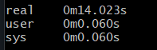

# Sprawozdanie – Lab 6

> **Autor:** 401967  
> **Data:** 2026-05-04  
> **Repozytorium:** git@github.com:Tomzonkal/DevOps2026.git

---

## Weryfikacja działania

Poniżej screenshoty potwierdzające że zadanie zostało wykonane poprawnie.
 
### Screenshot 1 – Baseline: czas budowania i rozmiar obrazu 
 


 
Obraz bazowy `python:3.11` bez żadnych optymalizacji: **419 MB**, czas budowania **14.023 s**. To punkt odniesienia dla wszystkich kolejnych pomiarów.
 
---
 
### Screenshot 2 – Optymalizacja 1: działanie cache po naprawieniu kolejności warstw
 


 
Po przestawieniu `COPY requirements.txt` i `pip install` przed `COPY app.py`: kolejne buildy bez zmian trwają **1.3 s** (wszystko z cache), a zmiana w kodzie aplikacji przebudowuje tylko ostatnią warstwę — `pip install` pozostaje `CACHED`.
 
---
 
### Screenshot 3 – Porównanie rozmiarów po optymalizacji 3 (slim)
 

 
Zmiana obrazu bazowego z `python:3.11` na `python:3.11-slim` zmniejsza rozmiar z **415 MB do 51.1 MB** (redukcja o ~88%). Przy próbie z `python:3.11-alpine` rozmiar spada do **26 MB**.
 
---
 
### Screenshot 4 – Finalny obraz po multi-stage build i weryfikacja curl 
 

 
Finalny obraz po multi-stage build: **47.1 MB**, czas buildu z cache **0.976 s**. Wszystkie endpointy działają poprawnie, dzielenie przez zero zwraca HTTP 400 z komunikatem `{"error": "Dzielenie przez zero"}`.
 
---

## Opis kroków

---

### Krok 1 – Aktualizacja repozytorium i stworzenie gałęzi

```bash
git fetch --all
git checkout main
git pull
git switch -c lab_6/new_branch_401967
git push
```

---

### Krok 2 – Przygotowanie środowiska pracy

```bash
cp -r Lab_6/app_0000 Lab_6/app_401967
cd Lab_6/app_401967
```

Cała dalsza praca odbywa się wewnątrz folderu `app_401967`. Oryginału `app_0000` nie modyfikujemy.

---

### Krok 3 – Pomiar stanu bazowego (baseline)

#### Krok 4.1 – Budowa obrazu baseline i pomiar czasu

```bash
time docker build -t kalkulator-baseline .
```

Wynik:

```
real    0m14.023s
user    0m0.060s
sys     0m0.060s
```

#### Krok 4.2 – Rozmiar obrazu baseline

```bash
docker images kalkulator-baseline
```

Wynik:

```
IMAGE                      ID            DISK USAGE   CONTENT SIZE
kalkulator-baseline:latest 33ed34195578  1.63GB       419MB
```

**Baseline: rozmiar 419 MB, czas budowania ~14 sekund.**

#### Krok 4.4 – Weryfikacja działania aplikacji

```bash
docker run -d --name kalkulator-test -p 5000:5000 kalkulator-baseline
curl -X POST http://localhost:5000/calculate \
  -H "Content-Type: application/json" \
  -d '{"a": 10, "op": "+", "b": 5}'
docker stop kalkulator-test && docker rm kalkulator-test
```

Wynik: `{"result": 15}` — aplikacja działa poprawnie.

---

### Krok 4 – Optymalizacja 1: kolejność warstw (cache)

#### Problem

Oryginalny `Dockerfile` (przed naprawą):

```dockerfile
FROM python:3.11
WORKDIR /app
COPY . .
RUN pip install -r requirements.txt
RUN pip install -r requirements-dev.txt
EXPOSE 5000
CMD ["python", "app.py"]
```

Dyrektywa `COPY . .` stała **przed** `pip install`. Docker cache działa warstwowo — każda zmiana w dowolnym pliku projektu (nawet literówka w komentarzu w `app.py`) unieważniała warstwę `COPY . .`, a tym samym wszystkie warstwy poniżej, w tym `pip install`. Efekt: przy każdej zmianie w kodzie Docker pobierał wszystkie pakiety od nowa.

#### Naprawa

```dockerfile
FROM python:3.11
WORKDIR /app
COPY requirements.txt .
RUN pip install --no-cache-dir -r requirements.txt
COPY app.py .
EXPOSE 5000
CMD ["python", "app.py"]
```

Najpierw kopiowany jest tylko `requirements.txt`, następnie instalowane są pakiety, a kod aplikacji (`app.py`) trafia do obrazu na końcu. Warstwa `pip install` jest unieważniana tylko wtedy gdy zmieni się `requirements.txt` — zmiany w `app.py` nie wpływają już na instalację pakietów. Flaga `--no-cache-dir` usuwa cache pip z warstwy, nieznacznie zmniejszając rozmiar obrazu.

#### Weryfikacja działania cache (trzy kroki)

**Krok i — pierwsze budowanie po naprawie kolejności:**

```
[+] Building 8.0s (10/10) FINISHED
=> [internal] load build definition from Dockerfile
=> transferring dockerfile: 208B
=> [internal] load .dockerignore
=> [2/5] WORKDIR /app
=> [3/5] COPY requirements.txt .
=> [4/5] RUN pip install --no-cache-dir -r requirements.txt          4.0s
=> [5/5] COPY app.py .
=> exporting to image                                                  1.6s
```

Wszystkie warstwy budowane od zera — `pip install` zajął ~4 sekundy.

**Krok ii — ponowny build bez żadnych zmian:**

```
[+] Building 1.3s (10/10) FINISHED
=> CACHED [2/5] WORKDIR /app
=> CACHED [3/5] COPY requirements.txt .
=> CACHED [4/5] RUN pip install --no-cache-dir -r requirements.txt
=> CACHED [5/5] COPY app.py .
```

Cały build trwał 1.3 sekundy — wszystkie warstwy wzięte z cache, `pip install` nie był wykonywany.

**Krok iii — build po drobnej zmianie w `app.py`:**

```
[+] Building 1.6s (10/10) FINISHED
=> CACHED [2/5] WORKDIR /app
=> CACHED [3/5] COPY requirements.txt .
=> CACHED [4/5] RUN pip install --no-cache-dir -r requirements.txt
=> [5/5] COPY app.py .                                                 0.1s
```

Warstwa `pip install` nadal z cache — przebudowany został tylko `COPY app.py`. Czas buildu: 1.6 sekundy.

**Obserwacja:** przed naprawą każda zmiana w `app.py` wymuszała pełną reinstalację pakietów (~14s). Po naprawieniu kolejności warstw zmiany w kodzie aplikacji powodują przebudowanie tylko ostatniej warstwy (~1.6s). Zysk: **~12 sekund** na każdym kolejnym buildzie.

---

### Krok 5 – Optymalizacja 2: plik `.dockerignore`

#### Problem (krok 6.1)

Bez pliku `.dockerignore` Docker wysyłał cały katalog projektu jako kontekst budowania. Widoczne w logach:

```
=> transferring context: 63B
```

W realnych projektach katalog `.git/`, `node_modules/` lub foldery z dużymi danymi mogą zwiększać kontekst do setek MB — każdy plik z kontekstu jest transferowany do demona Docker przy każdym buildzie, niezależnie od tego czy jest faktycznie kopiowany do obrazu. Istnieje też ryzyko przypadkowego skopiowania sekretów (np. pliku `.env`) do obrazu przez `COPY . .`.

#### Naprawa

Stworzono plik `.dockerignore` w folderze `app_401967/`:

```
__pycache__
*.pyc
*.pyo
*.pyd
.pytest_cache
tests/
.git
.gitignore
*.md
```

#### Weryfikacja (krok 6.3)

Po dodaniu `.dockerignore`:

```
[+] Building 1.2s (10/10) FINISHED
=> transferring context: 119B
```

Rozmiar kontekstu zmieniał się między buildami w zależności od tego które pliki tymczasowe były obecne. Plik `.dockerignore` gwarantuje że foldery `__pycache__/`, `tests/`, pliki `.pyc` ani katalog `.git` nigdy nie trafią do kontekstu ani do obrazu. W tym projekcie różnica liczbowa jest niewielka ze względu na mały rozmiar projektu — w produkcyjnych repozytoriach oszczędności mogą być rzędu setek MB.

---

### Krok 6 – Optymalizacja 3: zmiana obrazu bazowego

#### Problem

Obraz `python:3.11` to pełny obraz Debian z kompilatorem, narzędziami build i wieloma bibliotekami których aplikacja produkcyjna nie potrzebuje. Jego rozmiar to ~1 GB.

#### Naprawa (krok 7.1)

```dockerfile
FROM python:3.11-slim
```

Obraz `python:3.11-slim` to minimalna instalacja Debian zawierająca tylko interpreter Python i niezbędne zależności runtime.

#### Wyniki (krok 7.2)

```bash
docker images | grep kalkulator
```

```
kalkulator-cache:latest         4d6b29b34d26   1.62GB   415MB
kalkulator-ignore-test:latest   3e0e5419d2b4   1.62GB   415MB
kalkulator-ignorefile:latest    b367780f8a68   1.62GB   415MB
kalkulator-slim:latest          bf92855bea63   210MB    51.1MB
```

Zmiana obrazu bazowego z `python:3.11` na `python:3.11-slim` zmniejszyła rozmiar z **415 MB do 51.1 MB** — redukcja o ~88%.

#### Weryfikacja działania (krok 7.3)

```bash
docker run -d --name kalkulator-slim -p 5000:5000 kalkulator-slim
curl -X POST http://localhost:5000/calculate \
  -H "Content-Type: application/json" \
  -d '{"a": 7, "op": "*", "b": 6}'
docker stop kalkulator-slim && docker rm kalkulator-slim
```

Wynik: `{"result": 42}` — aplikacja działa poprawnie na slim.

#### Próba z Alpine (krok 7.4)

```bash
docker build -t kalkulator-alpine .
```

Build z `python:3.11-alpine` zakończył się sukcesem. Rozmiar obrazu:

```
kalkulator-alpine:latest   8d3635f3b579   108MB   26MB
```

Obraz Alpine ma rozmiar zaledwie **26 MB** — to najmniejszy wynik. Jednak Alpine używa biblioteki `musl libc` zamiast standardowej `glibc`, co może powodować problemy z bibliotekami skompilowanymi natywnie (np. `psycopg2`, `numpy`). Dla tej aplikacji (czyste Flask bez rozszerzeń C) Alpine działa poprawnie.

---

### Krok 7 – Optymalizacja 4: multi-stage build

#### Problem

Dotychczasowy Dockerfile instalował zarówno zależności produkcyjne (`requirements.txt`) jak i developerskie (`requirements-dev.txt`) w jednym obrazie. Narzędzia testowe (pytest itp.) trafiają do finalnego kontenera produkcyjnego, niepotrzebnie zwiększając jego rozmiar i powierzchnię ataku.

#### Naprawa — finalny `Dockerfile`

```dockerfile
FROM python:3.11-slim AS builder
WORKDIR /app
COPY requirements.txt .
RUN pip install --no-cache-dir --user -r requirements.txt

FROM python:3.11-slim
WORKDIR /app
COPY --from=builder /root/.local /root/.local
COPY app.py .
ENV PATH=/root/.local/bin:$PATH
EXPOSE 5000
CMD ["python", "app.py"]
```

Pierwszy stage (`builder`) instaluje pakiety z flagą `--user` — trafiają one do `/root/.local` zamiast do systemowego `/usr/lib/python3`. Drugi stage startuje od czystego `python:3.11-slim` i kopiuje wyłącznie folder `/root/.local` z zainstalowanymi pakietami produkcyjnymi. Zależności developerskie (`requirements-dev.txt`) w ogóle nie są instalowane w finalnym obrazie — cały stage `builder` jest odrzucany po zakończeniu kopiowania.

#### Wyniki (krok 8.2)

```bash
time docker build -t kalkulator-final .
```

```
[+] Building 7.5s (11/11) FINISHED
=> [builder 1/4] FROM docker.io/library/python:3.11-slim
=> CACHED [builder 2/4] WORKDIR /app
=> CACHED [builder 3/4] COPY requirements.txt .
=> [builder 4/4] RUN pip install --no-cache-dir --user -r requirements.txt    4.2s
=> [stage-1 3/4] COPY --from=builder /root/.local /root/.local
=> [stage-1 4/4] COPY app.py .

real    0m0.976s
user    0m0.123s
sys     0m0.091s
```

```bash
docker images kalkulator-final
```

```
IMAGE                    ID            DISK USAGE   CONTENT SIZE
kalkulator-final:latest  09ef8275360a  194MB        47.1MB
```

**Rozmiar finalnego obrazu: 47.1 MB**, czas budowania (z cache): **0.976 sekundy**.

#### Weryfikacja działania (krok 8.3)

```bash
docker run -d --name kalkulator-final -p 5000:5000 kalkulator-final

curl http://localhost:5000/health
```
Wynik: `{"status": "ok"}`

```bash
curl -X POST http://localhost:5000/calculate \
  -H "Content-Type: application/json" \
  -d '{"a": 10, "op": "+", "b": 5}'
```
Wynik: `{"result": 15}`

```bash
curl -X POST http://localhost:5000/calculate \
  -H "Content-Type: application/json" \
  -d '{"a": 10, "op": "/", "b": 0}'
```
Wynik: `{"error": "Dzielenie przez zero"}` (HTTP 400)

```bash
docker stop kalkulator-final && docker rm kalkulator-final
```

Wszystkie operacje działają poprawnie.

---

### Krok 8 – Commit i push

```bash
git add Lab_6/app_401967/
git commit -m "lab_6: zoptymalizowano Dockerfile kalkulatora"
git push
```

Następnie na GitHubie utworzono pull request z gałęzi `lab_6/new_branch_401967` do gałęzi `TEST`.

---

## Tabela podsumowująca optymalizacje

| Etap | Obraz bazowy | Rozmiar [MB] | Co zmieniono |
|------|-------------|:------------:|--------------|
| Baseline | python:3.11 | 419 | — |
| Po opt. 1 | python:3.11 | 415 | Kolejność warstw + `--no-cache-dir` |
| Po opt. 2 | python:3.11 | 415 | `.dockerignore` |
| Po opt. 3 | python:3.11-slim | 51.1 | Zmiana obrazu bazowego |
| Po opt. 4 | python:3.11-slim | 47.1 | Multi-stage build |

Łączna redukcja rozmiaru: **419 MB → 47.1 MB** (redukcja o ~89%).  
Łączna redukcja czasu buildu (z cache): **14 s → 0.976 s** (redukcja o ~93%).

---

## Podsumowanie

W tym laboratorium przeprowadziłam cztery optymalizacje Dockerfile aplikacji kalkulatora:

1. **Kolejność warstw** — przesunięcie `COPY requirements.txt` i `RUN pip install` przed `COPY app.py` powoduje że warstwa z zainstalowanymi pakietami jest cache'owana niezależnie od zmian w kodzie. Czas buildu po pierwszym zbudowaniu spadł z ~14s do ~1.6s.
2. **`.dockerignore`** — wykluczenie `__pycache__/`, `tests/`, `.git` i plików `.pyc` z kontekstu budowania eliminuje ryzyko przypadkowego skopiowania niepotrzebnych lub wrażliwych plików do obrazu.
3. **Zmiana obrazu bazowego** — zastąpienie `python:3.11` przez `python:3.11-slim` usunęło z obrazu kompilator i narzędzia Debian nieużywane przez aplikację; rozmiar spadł z 415 MB do 51.1 MB.
4. **Multi-stage build** — oddzielenie etapu budowania od etapu uruchomienia spowodowało że zależności developerskie (`requirements-dev.txt`) nie trafiają do finalnego obrazu produkcyjnego; rozmiar finalny wynosi 47.1 MB.