# Wstęp
Celem ćwiczenia było zapoznanie się z typowymi problemami bezpieczeństwa w konfiguracji Dockera i Docker Compose. Pomogło to w nauce identyfikacji i naprawy luki bezpieczeństwa w Dockerfile oraz pliku `docker-compose.yml`, rozumienia konsekwencji każdego z błędów oraz stosowania dobrych praktyk w budowaniu bezpiecznych obrazów kontenerów.

# Przebieg Ćwiczeń
Na początku standardowo aktualizujemy metadane, przełączamy gałąź na `main` i pobieramy zmiany w kodzie:

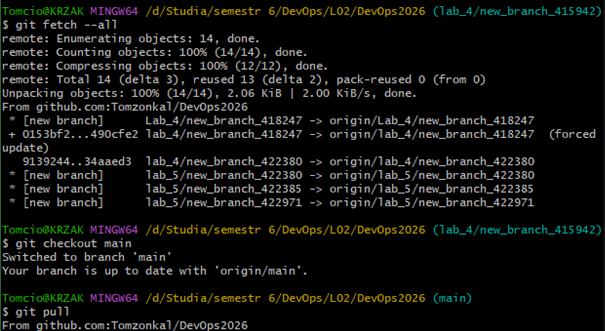

Teraz tworzymy nową gałąź z rozwiązaniem laboratorium:

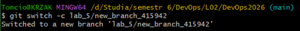

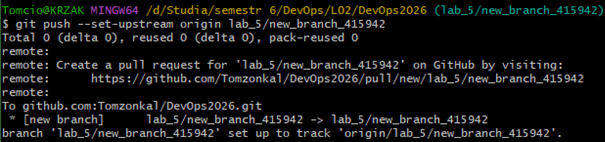

Teraz utworzymy kopię `app_0000` z numerem naszego indeksu, na której będziemy następnie pracować:

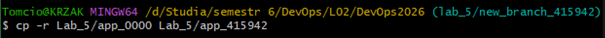

Dodatkowo tworzymy jeszcze centralny punkt zarządzania konfiguracją, czyli plik `.env` na podstawie skopiowanego pliku `.env.example`:

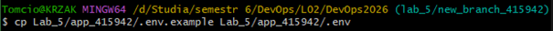

Teraz, po uruchomieniu aplikacji „Docker Desktop" startujemy „Docker Compose" w folderze `app_415942`:

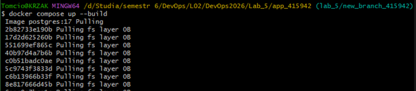

Przed rozpoczęciem pracy sprawdźmy jeszcze, czy aplikacja działa:

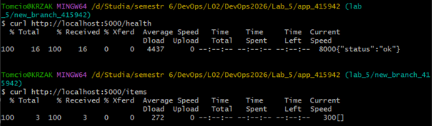

Widzimy, że status `/health` jest „ok", a lista `/items` pusta. Wszystko zatem jest w porządku. Przeprowadźmy teraz inspekcję warstw zbudowanego obrazu backendu za pomocą komendy:

`docker history lab5_app_123456_backend --no-trunc`

Wśród historii warstw możemy między innymi zaobserwować lukę bezpieczeństwa. Widać bezpośrednio dwie instrukcje ENV, które zapisują sztywno w obrazie poufne dane. Każdy, kto pobierze ten obraz, może uruchomić polecenie `docker history` i zobaczyć oba klucze:

```bash
<missing>10 minutes ago   ENV SECRET_KEY=my-secret-key-do-not-0B        buildkit.dockerfile.v0
<missing> 10 minutes ago   ENV API_KEY=super-secret-api-key- abc123
```

Możemy także zobaczyć, że obraz jest też bardzo obszerny w rozmiarze, co widać w poniższych fragmentach linijek:

```bash
72.8MB    buildkit.dockerfile.v0
694MB     buildkit.dockerfile.v0
202MB     buildkit.dockerfile.v0
65MB      buildkit.dockerfile.v0
134MB     debuerreotype 0.17
```

Sprawdźmy teraz z jakim użytkownikiem działa proces w kontenerze:

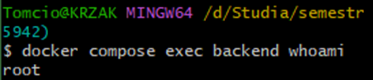

Teraz zamknijmy aplikację:

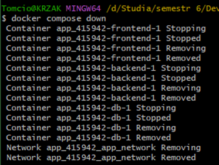

Wyślijmy teraz pliki `backend/Dockerfile`, `frontend/Dockerfile` oraz `docker-compose.yml` do chatu LLM, np. Gemini Pro, by zobaczyć jak zdiagnozuje on 4 poniższe błędy:
1. Niespięte wersje obrazów bazowych,
2. Hardkodowane sekrety w Dockerfile,
3. Hardkodowane hasło w docker-compose.yml,
4. Kontener uruchomiony jako root.

Oto odpowiedź Gemini:

> Oto gdzie dokładnie leżą problemy w Twoich plikach i jak je załatać:
> 
> **1. Niespięte wersje obrazów bazowych (Unpinned base image versions)**
> * Gdzie jest błąd: W pliku Dockerfile frontend ustawiłeś obraz bazowy jako `FROM nginx:latest`. O tym, dlaczego tag latest nie tenteguje, zdążyliśmy się już dzisiaj przekonać przy okazji bazy danych i Pythona. W środowiskach produkcyjnych użycie latest oznacza brak kontroli nad tym, jaka wersja serwera Nginx uruchomi się przy kolejnym budowaniu, co może popsuć aplikację lub przemycić luki z nowych wersji.
> * Jak naprawić: Zablokuj konkretną, lekką i bezpieczną wersję. W pliku Dockerfile frontend zmień pierwszą linijkę na:
>   `FROM nginx:1.25-alpine`
>   (Wersje alpine zajmują ułamek tego co standardowe obrazy i zawierają mniej narzędzi systemowych, co zmniejsza tzw. "powierzchnię ataku").
> 
> **2. Hardkodowane sekrety w Dockerfile**
> * Gdzie jest błąd: W Dockerfile backend wpisałeś jawnym tekstem `ENV API_KEY=super-secret-api-key-abc123` oraz `ENV SECRET_KEY=my-secret-key-do-not-share-2026`. To bardzo niebezpieczne! Każdy, kto pobierze Twój obraz, będzie mógł odczytać te klucze używając zwykłego polecenia `docker inspect`, nawet nie uruchamiając kontenera.
> * Jak naprawić: 1. Usuń całkowicie te dwie linijki z pliku Dockerfile backend. 2. Klucze podepnij dopiero podczas uruchamiania kontenera w `docker-compose.yml`, dodając je do sekcji backend -> environment.
> 
> **3. Hardkodowane hasło w docker-compose.yml**
> * Gdzie jest błąd: Twoje hasło `password123` leży na widoku w pliku `docker-compose.yml` w dwóch miejscach: w zmiennej `POSTGRES_PASSWORD` oraz jako część linku `DATABASE_URL`. Jeśli zrobisz `git commit`, to hasło trafi na zawsze do historii repozytorium.
> * Jak naprawić: Wynieś poświadczenia do zewnętrznego pliku, który będzie ignorowany przez system kontroli wersji (Git). Utwórz w głównym folderze plik o nazwie `.env` i wpisz do niego hasła i klucze. Upewnij się, że plik `.env` jest dodany do pliku `.gitignore`. Podmień wartości w `docker-compose.yml` na odwołania do tych zmiennych.
> 
> **4. Kontener uruchomiony jako root**
> * Gdzie jest błąd: Wewnątrz kontenerów, jeśli nie wskażesz inaczej, wszystkie procesy uruchamiają się na najwyższych prawach administratora (root). Oznacza to, że jeśli haker znajdzie np. lukę we frameworku Flask, od razu zdobędzie pełną kontrolę nad środowiskiem kontenera.
> * Jak naprawić: Na samym końcu budowania obrazu powinieneś stworzyć "zwykłego" użytkownika bez uprawnień i nakazać Dockerowi uruchamiać aplikację z jego konta. W pliku Dockerfile backend zmodyfikuj końcówkę poprzez stworzenie grupy i użytkownika `appuser`, zmianę uprawnień i instrukcję `USER appuser`.

Zajmijmy się najpierw pierwszym problemem. Musimy zmienić wersję obrazu z frontendowego Dockerfile z najnowszej, na lżejszą i bezpieczniejszą wersję, np. `1.25-alpine`:

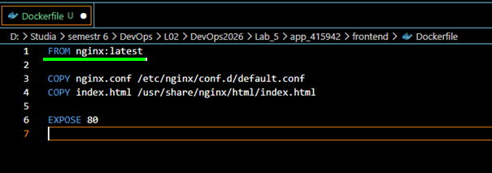

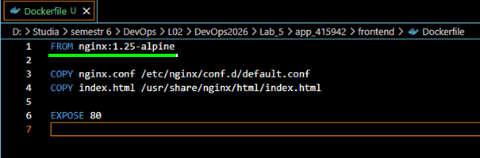

Kolejnym problemem są wcześniej wspomniane hardkodowane sekrety w backendowym Dockerfile. Należy je usunąć stąd i przenieść do `docker-compose.yml`.

Zmiana w backendowym Dockerfile:

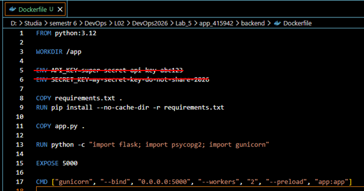

Zmiana w `docker-compose.yml`:

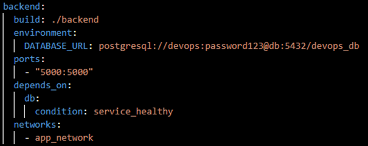

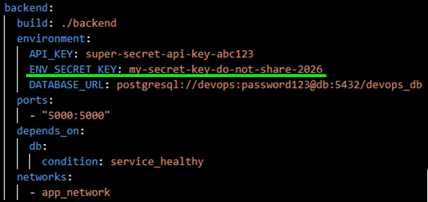

Teraz te klucze oraz hasło, w tym także hasło wewnątrz adresu URL bazy danych, trzeba zamienić na odwołania do pliku `.env` w głównym folderze, gdzie zostaną przeniesione.

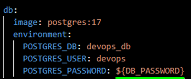

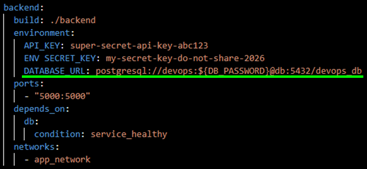

Plik `.env`:

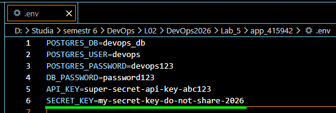

Dodajmy jeszcze wszystkie pliki z końcówką `.env` do pliku `.gitignore`, aby nie zostały one wysłane do publicznego repozytorium:

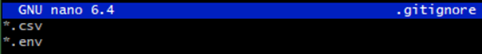

Ostatnim błędem jest uruchamianie kontenera jako root. Na końcu budowania obrazu musimy dodać "zwykłego" użytkownika z uprawnieniami jedynie do folderu z aplikacją i nakazać Dockerowi uruchamiać aplikację z właśnie tego konta. Musimy dodać poniższe linijki do backendowego Dockerfile:

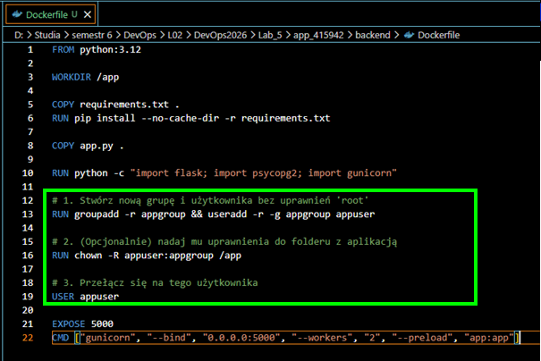

Uruchommy teraz Docker Compose i sprawdźmy czy działa poprawnie:

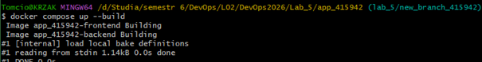

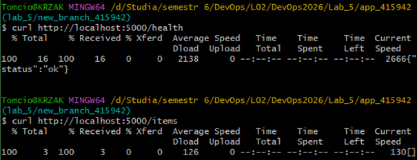

Zobaczmy teraz czy problemy rzeczywiście zostały rozwiązane. Sprawdźmy najpierw wersję obrazu. Możemy zobaczyć, że wersja NGINX to rzeczywiście 1.25:

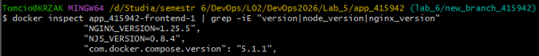

Możemy od razu zobaczyć, że użytkownikiem na którym działa kontener już nie jest root:

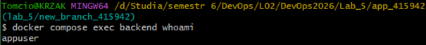

Włączmy `docker history`. Widzimy, że klucze już się nie wyświetlają:

```bash
<missing>
ENV PYTHON_SHA256=c08bc65a81971c1dd5783182826503369466c7e67374d1646519adf052076684
<missing>
ENV PYTHON_VERSION=3.12.13
<missing>
ENV GPG_KEY=7169605F62C751356D054A26A821E680E5FA6305
<missing>
RUN /bin/sh -c set -eux; apt-get update; apt-get install -y-no-install-recommends
<missing>
ENV LANG C.UTF-8
<missing>
ENV PATH=/usr/local/bin:/usr/local/sbin:/usr/local/bin:/usr/sbin:/usr/bin:/sbin:/bin
```

Zweryfikujmy jeszcze na końcu persystencję przy dodaniu przykładowego elementu:

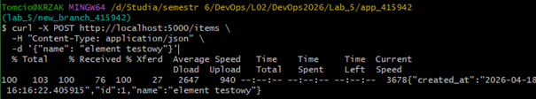

Teraz uruchommy aplikację ponownie. Element rzeczywiście przetrwał restart:

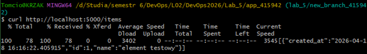

# Podsumowanie

W tym laboratorium skupiliśmy się na najlepszych praktykach bezpieczeństwa podczas pracy z Dockerem. Zidentyfikowaliśmy i załataliśmy cztery główne luki:
* **Ustalanie wersji obrazów (Image Pinning)** – zamieniliśmy tag `latest` na konkretną, bezpieczniejszą dystrybucję `alpine`, co zmniejszyło ryzyko ataków i znacząco odchudziło obraz.
* **Usuwanie twardych sekretów (Hardcoded Secrets)** – wynieśliśmy wrażliwe dane z pliku `Dockerfile` zapobiegając wyciekom w historii budowania obrazu (`docker history`).
* **Zarządzanie zmiennymi środowiskowymi** – przenieśliśmy hasła i klucze do wykluczonego z repozytorium pliku `.env`, poprawiając konfigurację `docker-compose.yml`.
* **Ograniczanie uprawnień (Least Privilege)** – skonfigurowaliśmy uruchamianie procesu w kontenerze z poziomu specjalnie utworzonego użytkownika `appuser` (zamiast domyślnego `root`), minimalizując potencjalne straty w przypadku włamania.

Dzięki tym zmianom uzyskaliśmy znacznie bezpieczniejsze i zoptymalizowane środowisko, spełniające podstawowe standardy produkcyjne.