# Sprawozdanie - Lab 5 Docker Security
> **Autor:** 421068  
> **Data:** 2026-04-14  
> **Repozytorium:** git@github.com:Tomzonkal/DevOps2026.git

---

## Cel laboratorium

Celem laboratorium było znalezienie i naprawienie problemów bezpieczeństwa w plikach `Dockerfile` i `docker-compose.yml`. W odróżnieniu od Lab 4 — aplikacja **działała poprawnie**, ale jej konfiguracja zawierała poważne luki. Zadaniem było ich znalezienie, naprawienie i wyjaśnienie dlaczego stanowią zagrożenie.

Do przeglądu bezpieczeństwa użyto modelu językowego (LLM, Claude) — jest to akceptowana praktyka w nowoczesnym DevOpsie. Zadanie polegało na wklejeniu zawartości plików do LLM, zrozumieniu wskazanych problemów i samodzielnym wprowadzeniu poprawek.

---

## 1. Przygotowanie środowiska

### 1.1 Aktualizacja repozytorium i stworzenie brancha

```bash
git fetch --all
git checkout main
git pull
git switch -c lab_5/new_branch_421068
git push
```

### 1.2 Skopiowanie folderu aplikacji i pliku .env

```bash
cp -r Lab_5/app_0000 Lab_5/app_421068
cp Lab_5/app_421068/.env.example Lab_5/app_421068/.env
```

Cała dalsza praca odbywała się wewnątrz folderu `app_421068`. Folder `app_0000` nie był modyfikowany.

---

## 2. Uruchomienie aplikacji i wstępna inspekcja

### 2.1 Uruchomienie i weryfikacja działania

```bash
cd Lab_5/app_421068
docker compose up --build
```

W osobnym terminalu sprawdzono oba endpointy:

```bash
curl http://localhost:5000/health
```
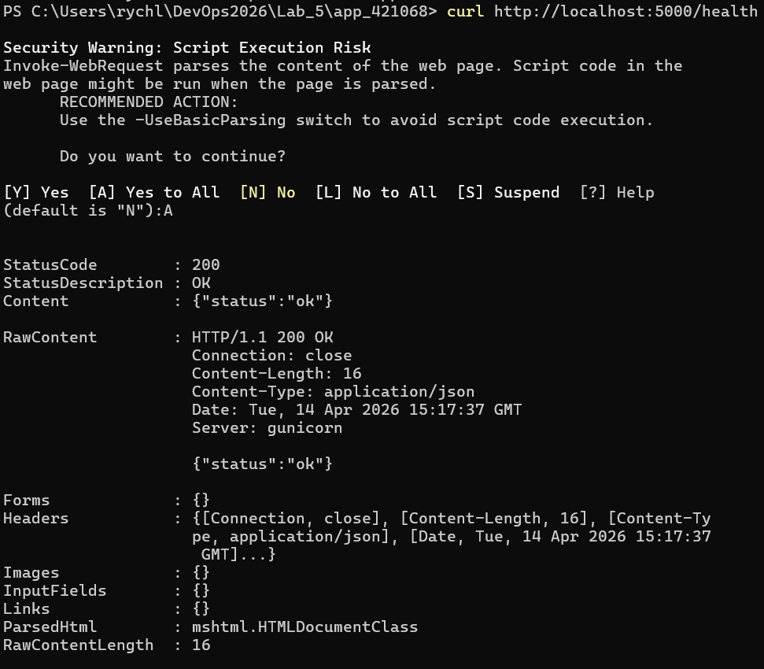

```bash
curl http://localhost:5000/items
```
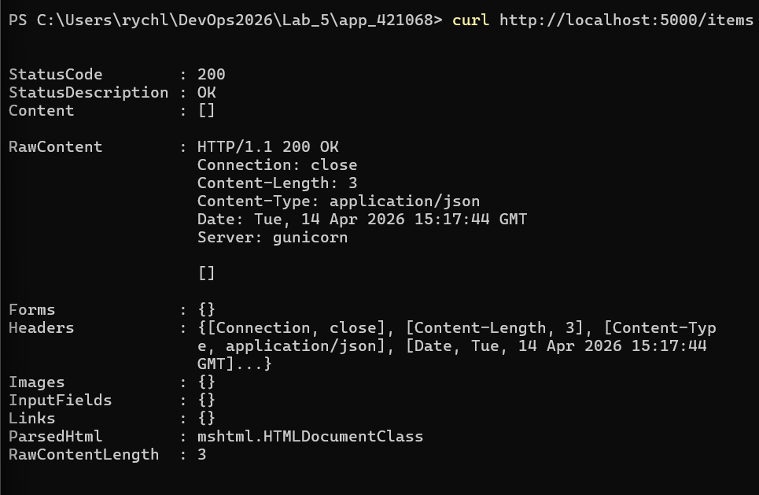

Zwróciły `{"status":"ok"}` i `[]`, więc aplikacja działa poprawnie.


**Ważna obserwacja:** brak błędów runtime nie oznacza braku problemów bezpieczeństwa.

### 2.2 Inspekcja obrazu i użytkownika procesu

Sprawdzono historię warstw zbudowanego obrazu:

```bash
docker history app_421068-backend:latest --no-trunc
```

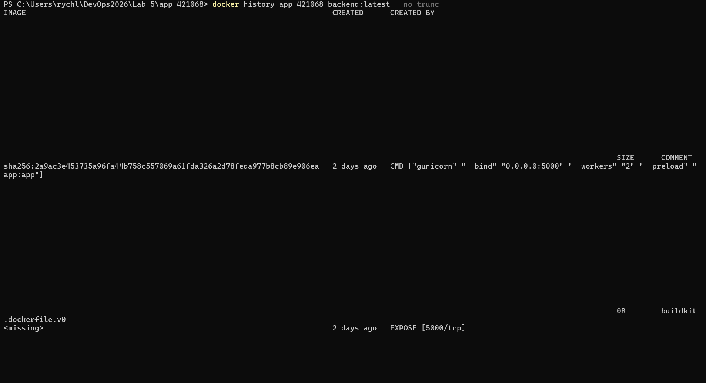

Historia warstw jest publiczna - każdy kto ma dostęp do obrazu może zobaczyć wszystkie kroki budowania. Jeśli w którymś kroku były sekrety, są widoczne jawnie.

Sprawdzono z jakim użytkownikiem działa proces w kontenerze:

```bash
docker compose exec backend whoami
```

Wynik: `root` - aplikacja działa z uprawnieniami administratora.

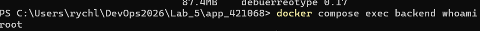

```bash
docker compose down
```

---

## 3. Identyfikacja i naprawa problemów bezpieczeństwa

Na podstawie analizy plików `backend/Dockerfile`, `frontend/Dockerfile` i `docker-compose.yml` przy pomocy LLM zidentyfikowano 4 problemy bezpieczeństwa.

---

### Błąd 1 — Niespięte wersje obrazów (`latest`)

**Przed naprawą:**
```dockerfile
FROM python:latest    # backend/Dockerfile
FROM nginx:latest     # frontend/Dockerfile
```
```yaml
image: postgres:latest    # docker-compose.yml
```

**Zagrożenie:** Tag `latest` nie oznacza konkretnej wersji — przy każdym `docker compose up --build` Docker może pobrać inną wersję obrazu. Nowa wersja może zawierać nowe podatności CVE, zmienione API lub inne zachowanie. Aplikacja może zepsuć się bez żadnej zmiany w kodzie, tylko dlatego że obraz bazowy się zmienił. W środowiskach produkcyjnych jest to niedopuszczalne — wdrożenia muszą być przewidywalne i powtarzalne.

**Po naprawie:**
```dockerfile
FROM python:3.11-slim     # backend/Dockerfile
FROM nginx:1.25-alpine    # frontend/Dockerfile
```
```yaml
image: postgres:15    # docker-compose.yml
```

**Weryfikacja:** Po przypięciu konkretnych wersji każdy build używa dokładnie tego samego obrazu bazowego, niezależnie od czasu wykonania.

---

### Błąd 2 — Sekrety zakodowane w Dockerfile (`ENV`)

**Przed naprawą:**
```dockerfile
ENV API_KEY=super-secret-api-key-abc123
ENV SECRET_KEY=my-secret-key-do-not-share-2026
```

**Zagrożenie:** Dyrektywa `ENV` zapisuje wartości na stałe w metadanych obrazu. Każdy kto posiada obraz może odczytać te wartości przez `docker inspect` — widać je wprost w sekcji `"Env"`. Poniżej wynik przed naprawą:

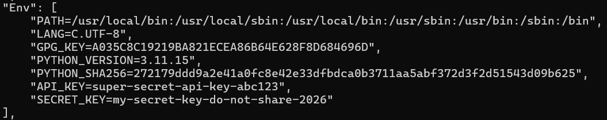

Sekrety są widoczne jako:
```
"API_KEY=super-secret-api-key-abc123",
"SECRET_KEY=my-secret-key-do-not-share-2026"
```

Dodatkowo linie `ENV` w Dockerfile trafiają do historii git i pozostają widoczne we wszystkich commitach nawet po późniejszym usunięciu.

**Po naprawie:** Usunięto linie `ENV` z Dockerfile. Sekrety są teraz przekazywane przez plik `.env` w czasie uruchomienia, nie budowania:

```yaml
# docker-compose.yml
backend:
  environment:
    API_KEY: ${API_KEY}
    SECRET_KEY: ${SECRET_KEY}
```

**Weryfikacja:** Po naprawie `docker inspect` nie zawiera już `API_KEY` ani `SECRET_KEY` w sekcji `"Env"` — sekcja zawiera tylko zmienne obrazu bazowego:

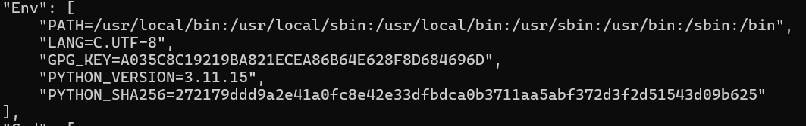

---

### Błąd 3 — Hasło bazy danych w `docker-compose.yml`

**Przed naprawą:**
```yaml
db:
  environment:
    POSTGRES_PASSWORD: "password123"

backend:
  environment:
    DATABASE_URL: postgresql://devops:password123@db:5432/devops_db
```

**Zagrożenie:** Plik `docker-compose.yml` jest plikiem konfiguracyjnym projektu i trafia do repozytorium git. Hasło zapisane jawnym tekstem jest widoczne dla każdego z dostępem do repo — w tym dla osób które dołączą do projektu w przyszłości. Co ważne, usunięcie hasła w późniejszym commicie nie wymazuje go z historii git — nadal można je odczytać przez `git log`. Jeśli repozytorium zostanie przypadkowo upublicznione, hasło do bazy danych jest natychmiast dostępne dla atakujących.

**Po naprawie:**
```yaml
db:
  environment:
    POSTGRES_PASSWORD: ${POSTGRES_PASSWORD}

backend:
  environment:
    DATABASE_URL: postgresql://${POSTGRES_USER}:${POSTGRES_PASSWORD}@db:5432/${POSTGRES_DB}
```

Rzeczywiste wartości przechowywane są tylko w pliku `.env`, który nie trafia do repozytorium:

```bash
# .env
POSTGRES_PASSWORD=devops123
POSTGRES_USER=devops
POSTGRES_DB=devops_db
```

```bash
# .gitignore
.env
```

**Weryfikacja:** Plik `docker-compose.yml` nie zawiera żadnych jawnych haseł. Plik `.env` jest ignorowany przez git — nie pojawia się w `git status`.

---

### Błąd 4 — Kontener uruchomiony jako root

**Przed naprawą:** Brak dyrektywy `USER` w `backend/Dockerfile`. Polecenie `docker compose exec backend whoami` zwróciło `root`.


**Zagrożenie:** Gdy aplikacja działa jako root (uid=0), każda podatność w kodzie aplikacji lub jej zależnościach (np. Remote Code Execution) daje atakującemu uprawnienia roota wewnątrz kontenera. Root w kontenerze to nie to samo co root na hoście, ale w połączeniu z innymi błędami konfiguracyjnymi — np. podmontowaniem `/var/run/docker.sock` lub trybem `--privileged` — może prowadzić do pełnego przejęcia maszyny hostującej. Zasada minimalnych uprawnień nakazuje żeby proces miał tylko tyle uprawnień ile potrzebuje do działania.

**Po naprawie:**
```dockerfile
RUN addgroup --system appgroup && adduser --system --ingroup appgroup appuser
USER appuser
```

**Weryfikacja:** Po przebudowie `docker compose exec backend whoami` zwraca `appuser` zamiast `root`:

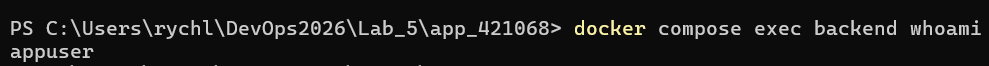

---

## 4. Weryfikacja po naprawach

Po wprowadzeniu wszystkich poprawek przebudowano i uruchomiono aplikację:

```bash
docker compose up --build
```

## 4.1 Weryfikacja health i items
Oba endpointy nadal zwracają 200 OK — naprawy nie zepsuły działania aplikacji:

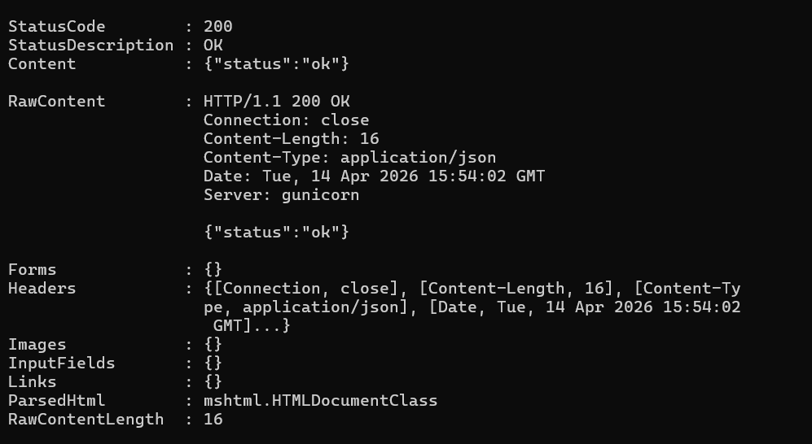
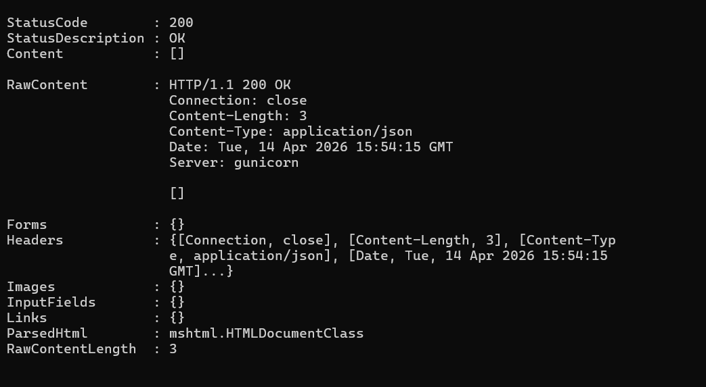

## 4.2 Kontener NIE działa już jako root
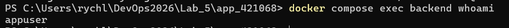


## 4.3 Sekrety NIE są widoczne w historii warstw obrazu
Historia warstw po naprawie zawiera `USER appuser` i `RUN addgroup/adduser` — nie ma już żadnych linii `ENV` z sekretami:


---

## 4.4 Weryfikacja persystencji danych

Dodano element testowy i sprawdzono czy przetrwa restart aplikacji:

```powershell
curl.exe -X POST http://localhost:5000/items -H "Content-Type: application/json" -d '{\"name\": \"element testowy\"}'
```

Następnie zatrzymano i uruchomiono aplikację ponownie:

```bash
docker compose down
docker compose up -d
curl http://localhost:5000/items
```

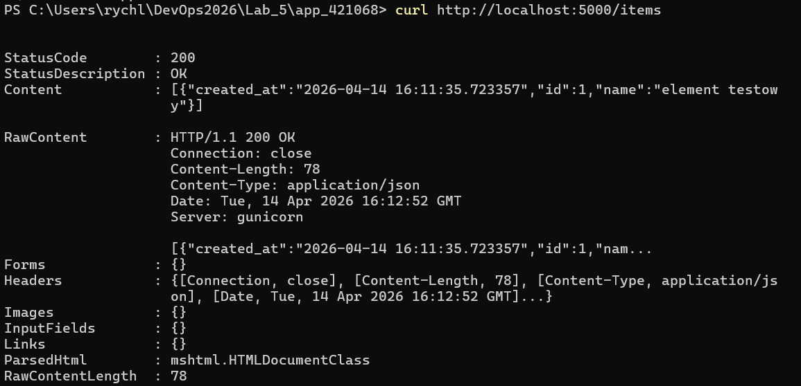

Element nadal widoczny na liście po restarcie — wolumen `postgres_data` poprawnie persystuje dane bazy danych.

---

## 6. Wnioski

Laboratorium pokazało że działająca aplikacja może zawierać poważne luki bezpieczeństwa, które są całkowicie niewidoczne na poziomie funkcjonalnym. Wszystkie cztery błędy dotyczyły różnych warstw konfiguracji: wersjonowania obrazów, sekretów w warstwie budowania, sekretów w konfiguracji środowiska oraz uprawnień procesów — co pokazuje że nie ma jednego miejsca które wystarczy zabezpieczyć.

Użycie LLM do security review okazało się skutecznym podejściem — pozwoliło szybko zidentyfikować wszystkie problemy i zrozumieć ich konsekwencje techniczne.


## 7. Tematy dodatkowe
 
### 7.1 Docker Content Trust (DCT)
 
Docker Content Trust to mechanizm weryfikacji autentyczności i integralności obrazów Docker. Działa na zasadzie podpisów kryptograficznych — publisher podpisuje obraz przy publikacji, a Docker weryfikuje podpis przy pobieraniu. Dzięki temu mamy pewność że obraz pochodzi od zaufanego źródła i nie został zmodyfikowany po podpisaniu.
 
DCT używa projektu Notary, który oparty jest na frameworku TUF (The Update Framework). Każdy obraz jest podpisany kluczem prywatnym publishera — przy `docker pull` Docker sprawdza podpis względem klucza publicznego przechowywanego w rejestrze.
 
**Jak włączyć:**
 
```bash
# Włączenie DCT dla bieżącej sesji
export DOCKER_CONTENT_TRUST=1
 
# Lub na stałe w ~/.bashrc / ~/.zshrc
echo "export DOCKER_CONTENT_TRUST=1" >> ~/.bashrc
```
 
**Co zmienia w praktyce:**
 
Po włączeniu DCT `docker pull` pobierze obraz tylko jeśli jest podpisany. Próba pobrania niepodpisanego obrazu zakończy się błędem:
 
```
Error: remote trust data does not exist for docker.io/library/nieznany-obraz
```
 
Przy `docker push` Docker automatycznie podpisuje publikowany obraz. Przy pierwszym push generowane są klucze — root key (przechowywany lokalnie, bardzo ważny) oraz repository key (zarządzany przez rejestr).
 
DCT chroni przed atakami typu "image substitution" — sytuacją gdy ktoś podmienia obraz w rejestrze na złośliwą wersję o tej samej nazwie i tagu.
 
---
 
### 7.2 Multi-stage builds
 
Multi-stage build to technika budowania obrazów Docker w kilku etapach w ramach jednego Dockerfile. Każdy etap (`FROM ... AS nazwa`) tworzy tymczasowy obraz — do finalnego obrazu kopiujemy tylko to co faktycznie potrzebne do uruchomienia aplikacji.
 
**Jak to wygląda w praktyce — przykład dla aplikacji Go:**
 
```dockerfile
# Etap 1 — budowanie (zawiera kompilator, narzędzia, zależności dev)
FROM golang:1.21 AS builder
WORKDIR /app
COPY . .
RUN go build -o myapp .
 
# Etap 2 — finalny obraz (zawiera TYLKO skompilowany plik)
FROM alpine:3.19
COPY --from=builder /app/myapp /usr/local/bin/myapp
CMD ["myapp"]
```
 
Finalny obraz zawiera tylko `alpine` i skompilowany plik binarny — nie zawiera kompilatora Go, kodu źródłowego ani żadnych narzędzi deweloperskich.
 
**Jak to zmniejsza powierzchnię ataku:**
 
Każde narzędzie i biblioteka w obrazie to potencjalny wektor ataku. Kompilator, menedżer pakietów, narzędzia debugowania — wszystko to zawiera kod który może mieć podatności. Multi-stage build pozwala wyrzucić cały ten balast z finalnego obrazu. Mniejszy obraz = mniej kodu = mniej możliwych podatności. Dodatkowo kod źródłowy aplikacji nie trafia do finalnego obrazu, co chroni własność intelektualną.
 
W kontekście tego laboratorium — gdybyśmy zastosowali multi-stage build dla backendu Python, finalny obraz mógłby zawierać tylko zainstalowane paczki i `app.py`, bez narzędzi budowania.
 
---
 
### 7.3 Docker Secrets vs zmienne środowiskowe
 
**Docker Secrets** to mechanizm bezpiecznego zarządzania sekretami dostępny w Docker Swarm. Sekrety są przechowywane w zaszyfrowanej bazie danych Swarm (opartej na Raft), przesyłane do kontenerów przez szyfrowany kanał TLS i montowane jako pliki w `/run/secrets/` — nie jako zmienne środowiskowe.
 
**Jak to działa:**
 
```bash
# Utworzenie sekretu
echo "moje_haslo" | docker secret create db_password -
 
# Użycie w docker-compose (tryb Swarm)
services:
  backend:
    secrets:
      - db_password
 
secrets:
  db_password:
    external: true
```
 
Aplikacja odczytuje sekret z pliku:
```python
with open('/run/secrets/db_password') as f:
    password = f.read().strip()
```
 
**Czym różni się od zmiennych środowiskowych:**
 
| | Zmienne środowiskowe | Docker Secrets |
|---|---|---|
| Przechowywanie | W konfiguracji kontenera | Zaszyfrowana baza Swarm |
| Widoczność | `docker inspect` ujawnia wartości | Niewidoczne w inspect |
| Dostęp | Każdy proces w kontenerze | Tylko uprawnione serwisy |
| Dostępność | Docker Compose i Swarm | Tylko Docker Swarm |
| Montowanie | Jako zmienna w pamięci | Jako plik w /run/secrets/ |
 
Główna przewaga Docker Secrets nad zmiennymi środowiskowymi jest taka że wartości sekretów nie są widoczne przez `docker inspect` ani w logach — co było właśnie problemem opisanym w Błędzie 2 tego laboratorium. Wadą jest konieczność używania Docker Swarm — w środowiskach opartych wyłącznie na Docker Compose stosuje się zmienne z pliku `.env` jako kompromis, tak jak zrobiono w tym laboratorium.