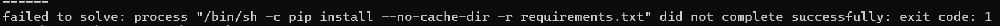
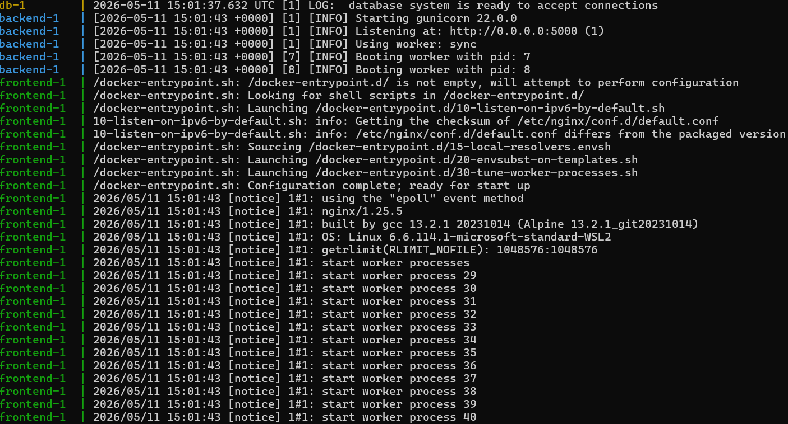
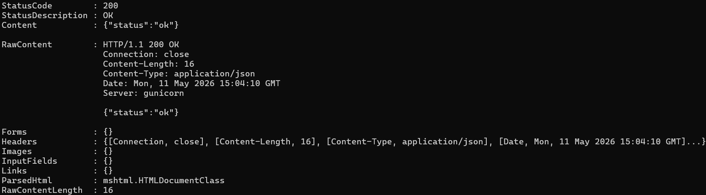
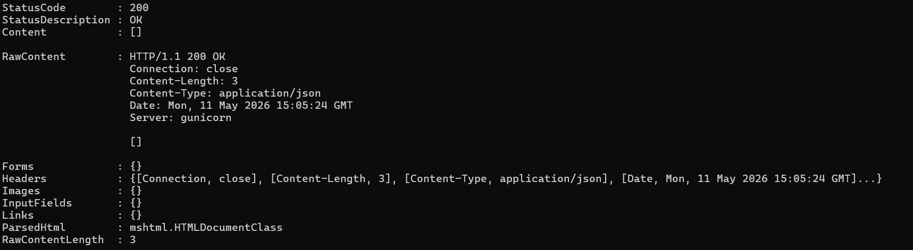
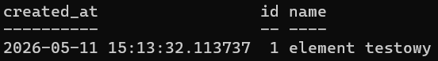
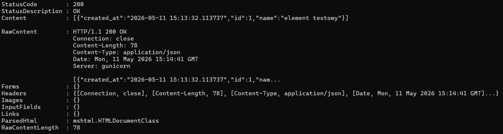

# Sprawozdanie Lab 5 - Docker Security

Numer indeksu: 422379

Katalog roboczy: `Lab_5/app_422379`

Katalog ze screenshotami: `Lab_5/screenshots`

## 1. Cel laboratorium

Celem laboratorium było przeprowadzenie przeglądu bezpieczeństwa konfiguracji Docker i Docker Compose, znalezienie błędów bezpieczeństwa oraz ich poprawienie. Analizie podlegały pliki:

- `backend/Dockerfile`
- `frontend/Dockerfile`
- `docker-compose.yml`

## 2. Przygotowanie repozytorium i środowiska

Na początku zaktualizowałem metadane projektu:

```bash
git fetch --all
```

Następnie przełączyłem się na branch `main` i pobrałem aktualne zmiany:

```bash
git checkout main
git pull
```

Utworzyłem nowy branch z rozwiązaniem laboratorium:

```bash
git switch -c lab_5/new_branch_422379
git push
```

Skopiowałem folder `app_0000` do folderu `app_422379`:

```bash
cp -r Lab_5/app_0000 Lab_5/app_422379
```

W skopiowanym folderze utworzyłem plik `.env` na podstawie `.env.example`:

```bash
cp Lab_5/app_422379/.env.example Lab_5/app_422379/.env
```

Cała dalsza praca była wykonywana w katalogu:

```bash
Lab_5/app_422379
```

## 3. Pierwsze uruchomienie aplikacji

Po przejściu do katalogu aplikacji uruchomiłem:

```bash
docker compose up --build
```

Build zakończył się błędem podczas instalacji zależności backendu:

```text
failed to solve: process "/bin/sh -c pip install --no-cache-dir -r requirements.txt" did not complete successfully: exit code: 1
```

Screenshot błędu:



Przyczyną błędu było użycie obrazu:

```dockerfile
FROM python:latest
```

Tag `latest` pobrał Pythona 3.14, a zależność:

```text
psycopg2-binary==2.9.9
```

nie zbudowała się poprawnie dla tej wersji Pythona. Ten błąd potwierdził jeden z problemów opisanych w instrukcji, czyli używanie niespiętych wersji obrazów bazowych.

## 4. Analiza LLM / własna analiza konfiguracji

Przeprowadzona analiza konfiguracji Docker wskazała 4 problemy wymagane w instrukcji:

- użycie tagów `latest` dla obrazów bazowych,
- hardkodowane sekrety `API_KEY` i `SECRET_KEY` w `backend/Dockerfile`,
- hardkodowane hasło do bazy danych w `docker-compose.yml`,
- brak instrukcji `USER` w `backend/Dockerfile`, czyli uruchamianie backendu jako `root`.

Poniżej opisano każdy problem, jego konsekwencje, poprawkę oraz sposób weryfikacji.

## 5. Błąd 1 - niespięte wersje obrazów bazowych

### Stan przed poprawką

W plikach konfiguracyjnych użyto tagów `latest`:

```dockerfile
FROM python:latest
```

```dockerfile
FROM nginx:latest
```

```yaml
image: postgres:latest
```

### Zagrożenie

Tag `latest` nie wskazuje na jedną stałą wersję obrazu. Obraz bazowy może zmienić się bez zmiany kodu projektu, przez co build staje się niepowtarzalny. Może to spowodować błędy kompatybilności, pobranie podatnej wersji obrazu albo inne zachowanie aplikacji między kolejnymi uruchomieniami.

W tym laboratorium problem wystąpił realnie: `python:latest` pobrał Pythona 3.14 i backend przestał się budować.

### Stan po poprawce

W `backend/Dockerfile` ustawiono konkretną wersję Pythona:

```dockerfile
FROM python:3.11-slim
```

W `frontend/Dockerfile` ustawiono konkretną wersję Nginx:

```dockerfile
FROM nginx:1.25-alpine
```

W `docker-compose.yml` ustawiono konkretną wersję PostgreSQL:

```yaml
image: postgres:15
```

### Weryfikacja

Po poprawce ponownie uruchomiłem:

```bash
docker compose up --build
```

Aplikacja zbudowała się i uruchomiła poprawnie. W logach widoczne było uruchomienie PostgreSQL, Gunicorna dla backendu oraz Nginx dla frontendu.

Screenshot poprawnego uruchomienia:



## 6. Błąd 2 - hardkodowane sekrety w Dockerfile

### Stan przed poprawką

W `backend/Dockerfile` znajdowały się sekrety zapisane bezpośrednio w obrazie:

```dockerfile
ENV API_KEY=super-secret-api-key-abc123
ENV SECRET_KEY=my-secret-key-do-not-share-2026
```

### Zagrożenie

Sekrety zapisane przez `ENV` w Dockerfile trafiają do warstw obrazu. Osoba mająca dostęp do obrazu może odczytać je za pomocą `docker history` albo `docker inspect`. Oznacza to ryzyko wycieku kluczy API, sekretów aplikacji i innych danych wrażliwych.

### Stan po poprawce

Usunąłem z `backend/Dockerfile` linie:

```dockerfile
ENV API_KEY=super-secret-api-key-abc123
ENV SECRET_KEY=my-secret-key-do-not-share-2026
```

Sekrety są przekazywane przez `docker-compose.yml` z pliku `.env`:

```yaml
environment:
  DATABASE_URL: postgresql://${POSTGRES_USER}:${POSTGRES_PASSWORD}@db:5432/${POSTGRES_DB}
  API_KEY: ${API_KEY}
  SECRET_KEY: ${SECRET_KEY}
```

### Weryfikacja

Przed poprawką nie udało się uzyskać historii gotowego obrazu backendu, ponieważ build zatrzymał się na błędzie instalacji zależności. Sam plik `backend/Dockerfile` potwierdzał jednak problem, ponieważ zawierał jawne wartości `API_KEY` i `SECRET_KEY`.

Po poprawce sprawdziłem historię warstw obrazu. Polecenie z README było przykładowe dla katalogu `app_123456`:

```bash
docker history lab5_app_123456_backend --no-trunc
```

Dla mojego katalogu Docker Compose utworzył obraz o nazwie:

```text
app_422379-backend
```

Dlatego użyłem:

```bash
docker history app_422379-backend --no-trunc
```

Obserwacje z historii warstw:

- widoczne są polecenia `CMD`, `EXPOSE`, `USER`, `RUN`, `COPY` i `WORKDIR`,
- widoczna jest warstwa `USER appuser`,
- widoczna jest warstwa tworząca użytkownika `appuser`,
- widoczna jest instalacja zależności przez `pip install --no-cache-dir -r requirements.txt`,
- widoczne są warstwy obrazu bazowego `python:3.11-slim`,
- nie ma wartości `API_KEY`,
- nie ma wartości `SECRET_KEY`,
- nie ma starego sekretu `super-secret-api-key-abc123`,
- nie ma starego sekretu `my-secret-key-do-not-share-2026`.

Wniosek: sekrety zostały usunięte z Dockerfile i nie są już zapisane w historii warstw obrazu backendu.

## 7. Błąd 3 - hardkodowane hasło w docker-compose.yml

### Stan przed poprawką

W `docker-compose.yml` hasło do bazy danych było wpisane jawnie:

```yaml
POSTGRES_PASSWORD: "password123"
```

To samo hasło znajdowało się również w `DATABASE_URL`:

```yaml
DATABASE_URL: postgresql://devops:password123@db:5432/devops_db
```

### Zagrożenie

Plik `docker-compose.yml` trafia do repozytorium Git. Hasło zapisane bezpośrednio w tym pliku staje się częścią historii commitów i może być odczytane przez każdą osobę z dostępem do repozytorium. Późniejsze usunięcie hasła z aktualnej wersji pliku nie usuwa go z historii Git.

### Stan po poprawce

W `docker-compose.yml` dane bazy są pobierane ze zmiennych środowiskowych:

```yaml
environment:
  POSTGRES_DB: ${POSTGRES_DB}
  POSTGRES_USER: ${POSTGRES_USER}
  POSTGRES_PASSWORD: ${POSTGRES_PASSWORD}
```

Adres połączenia backendu z bazą również korzysta ze zmiennych:

```yaml
DATABASE_URL: postgresql://${POSTGRES_USER}:${POSTGRES_PASSWORD}@db:5432/${POSTGRES_DB}
```

Dodatkowo dodałem plik `app_422379/.gitignore`:

```gitignore
.env
```

Dzięki temu lokalny plik `.env` z sekretami nie powinien zostać dodany do repozytorium.

### Weryfikacja

Weryfikacja polega na sprawdzeniu, że w `docker-compose.yml` nie ma już wartości `password123`, a konfiguracja używa zmiennych z `.env`.

Można to sprawdzić poleceniem:

```bash
docker compose config
```

## 8. Błąd 4 - kontener backendu uruchomiony jako root

### Stan przed poprawką

W `backend/Dockerfile` nie było instrukcji `USER`. W takiej sytuacji proces w kontenerze działa domyślnie jako użytkownik `root`.

### Zagrożenie

Jeżeli aplikacja uruchomiona jako `root` zawiera podatność, na przykład zdalne wykonanie kodu, atakujący uzyskuje uprawnienia roota wewnątrz kontenera. Zwiększa to ryzyko eskalacji uprawnień i ułatwia dalszy atak na środowisko.

### Stan po poprawce

W `backend/Dockerfile` dodałem dedykowanego użytkownika aplikacyjnego:

```dockerfile
RUN addgroup --system appgroup && adduser --system --ingroup appgroup appuser
USER appuser
```

### Weryfikacja

Przed poprawką nie wykonałem skutecznie `docker compose exec backend whoami`, ponieważ backend nie uruchomił się przez błąd builda. Brak instrukcji `USER` w Dockerfile oznaczał jednak, że kontener działałby domyślnie jako `root`.

Po poprawce wykonałem:

```bash
docker compose exec backend whoami
```

Wynik:

```text
appuser
```

Wniosek: backend nie działa już jako `root`, tylko jako dedykowany użytkownik `appuser`.

## 9. Weryfikacja działania aplikacji po poprawkach

Po poprawkach aplikacja została uruchomiona poleceniem:

```bash
docker compose up --build
```

Następnie sprawdziłem endpoint zdrowia:

```bash
curl http://localhost:5000/health
```

Wynik:

```json
{"status":"ok"}
```

Status HTTP:

```text
200 OK
```

Screenshot:



Następnie sprawdziłem listę elementów:

```bash
curl http://localhost:5000/items
```

Wynik:

```json
[]
```

Status HTTP:

```text
200 OK
```

Screenshot:



## 10. Weryfikacja persystencji danych

Dodałem przykładowy element. W PowerShellu można użyć:

```powershell
Invoke-RestMethod -Method Post `
  -Uri "http://localhost:5000/items" `
  -ContentType "application/json" `
  -Body '{"name": "element testowy"}'
```

Wynik dodania elementu:

```text
id: 1
name: element testowy
created_at: 2026-05-11 15:13:32.113737
```

Screenshot:



Następnie zatrzymałem i ponownie uruchomiłem aplikację:

```bash
docker compose down
docker compose up -d
```

Po restarcie wykonałem:

```bash
curl http://localhost:5000/items
```

Wynik:

```json
[{"created_at":"2026-05-11 15:13:32.113737","id":1,"name":"element testowy"}]
```

Screenshot:



Wniosek: dane przetrwały restart kontenerów, ponieważ element `element testowy` nadal znajduje się w odpowiedzi endpointu `/items`.

## 11. Podsumowanie zmian

W ramach laboratorium wykonano następujące poprawki:

- przypięto wersje obrazów bazowych zamiast używania `latest`,
- usunięto hardkodowane sekrety z `backend/Dockerfile`,
- przeniesiono `API_KEY` i `SECRET_KEY` do zmiennych środowiskowych,
- usunięto hardkodowane hasło `password123` z `docker-compose.yml`,
- skonfigurowano `DATABASE_URL` na podstawie zmiennych z `.env`,
- dodano `.env` do `.gitignore`,
- dodano użytkownika `appuser`,
- uruchomiono backend bez uprawnień roota,
- zweryfikowano działanie endpointów `/health` i `/items`,
- zweryfikowano persystencję danych po restarcie kontenerów,
- zweryfikowano, że sekrety nie są widoczne w historii warstw obrazu backendu.

Zmodyfikowane pliki:

- `app_422379/backend/Dockerfile`
- `app_422379/frontend/Dockerfile`
- `app_422379/docker-compose.yml`
- `app_422379/.gitignore`

Utworzony katalog ze screenshotami:

- `screenshots/`

## 12. Tematy dodatkowe

### Docker Content Trust (DCT)

Docker Content Trust to mechanizm weryfikacji autentyczności i integralności obrazów Dockera. Po włączeniu DCT Docker sprawdza podpisy obrazów, dzięki czemu użytkownik ma pewność, że pobierany obraz pochodzi od zaufanego wydawcy i nie został podmieniony.

DCT można włączyć zmienną środowiskową:

```bash
export DOCKER_CONTENT_TRUST=1
```

W PowerShellu:

```powershell
$env:DOCKER_CONTENT_TRUST=1
```

W praktyce po włączeniu DCT polecenia takie jak `docker pull`, `docker build` i `docker run` będą wymagały podpisanych obrazów. Jeśli obraz nie ma poprawnego podpisu, Docker odmówi jego użycia. Zwiększa to bezpieczeństwo łańcucha dostaw obrazów.

### Multi-stage builds

Multi-stage build to technika budowania obrazu w kilku etapach w jednym Dockerfile. W pierwszym etapie można zainstalować narzędzia developerskie, kompilatory i zależności potrzebne tylko do budowania aplikacji. Do końcowego obrazu kopiuje się wyłącznie gotowy wynik, np. pliki binarne albo zbudowaną aplikację.

Dzięki temu końcowy obraz jest mniejszy i zawiera mniej pakietów. Zmniejsza to powierzchnię ataku, bo w obrazie produkcyjnym nie ma niepotrzebnych narzędzi, bibliotek developerskich, cache ani plików źródłowych, które mogłyby ułatwić atak.

### Docker Secrets w Docker Swarm

Docker Secrets to mechanizm bezpiecznego przekazywania sekretów do kontenerów w Docker Swarm. Sekrety tworzy się poleceniem:

```bash
docker secret create nazwa_sekretu plik_z_sekretem
```

Następnie sekret jest udostępniany tylko wybranym usługom i montowany w kontenerze jako plik, zwykle w katalogu `/run/secrets/`. Aplikacja odczytuje sekret z pliku, a nie ze zmiennej środowiskowej.

Różnica względem zmiennych środowiskowych jest istotna: zmienne środowiskowe mogą być widoczne w `docker inspect`, logach, konfiguracji procesu albo przypadkowo wypisane przez aplikację. Docker Secrets ogranicza widoczność sekretu i przekazuje go tylko usługom, które go potrzebują. Jest to bezpieczniejsze rozwiązanie dla środowisk produkcyjnych niż trzymanie haseł w `.env` lub `environment`.
