# Wstęp
Celem ćwiczenia było zapoznanie się z technikami optymalizacji obrazów Docker: zmniejszanie rozmiaru finalnego obrazu, przyspieszanie buildów przez właściwe wykorzystanie cache warstw, multi-stage builds oraz dobór odpowiedniego obrazu bazowego.

# Przebieg Ćwiczeń
Na początku standardowo aktualizujemy metadane, przełączamy gałąź na `main` i pobieramy zmiany w kodzie:

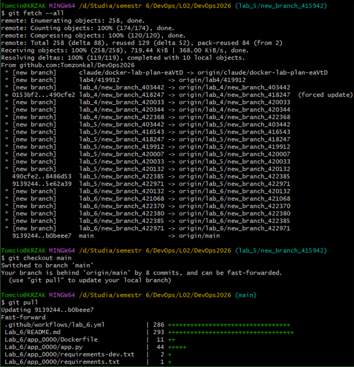

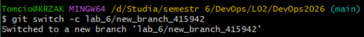

Teraz tworzymy nową gałąź z rozwiązaniem laboratorium:

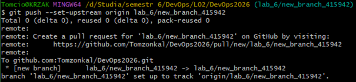

Teraz utworzymy kopię `app_0000` z numerem naszego indeksu, na której będziemy następnie pracować:

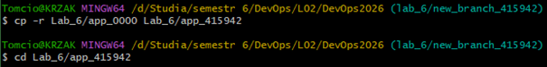

Pierwszym głównym punktem laboratoriów będzie optymalizacja obrazu pod względem jego rozmiaru oraz czasu budowania. Na samym początku musimy ustalić punkt odniesienia, czyli sprawdzić parametry obrazu przed próbą jego optymalizacji. Najpierw zbudujmy obraz "as-is" ze sprawdzeniem czasu:

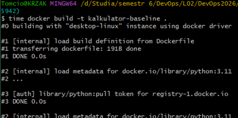

Zobaczmy czas buildu:

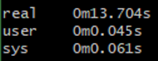

Oraz rozmiar obrazu:

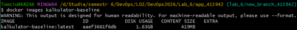

Zweryfikujmy jeszcze, czy aplikacja poprawnie działa:

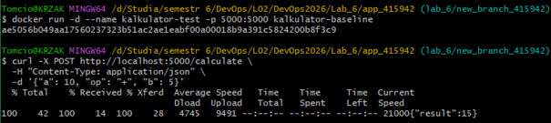

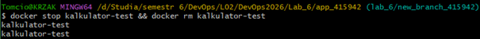

Dodawanie 10+5 zwróciło wynik 15, więc wszystko jest OK. Zatrzymajmy test i usuńmy go:

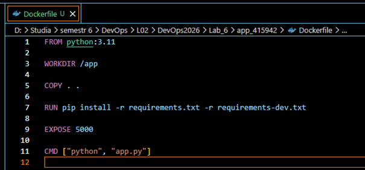

Spróbujmy teraz skrócić czas budowania przez zmianę kolejności warstw. Sprawdźmy zawartość pliku Dockerfile:

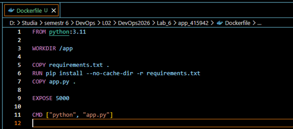

Możemy zobaczyć, że całe kopiowanie zachodzi przed `pip install`. To powoduje, że każda, nawet minimalna zmiana w kodzie powoduje ponowne instalowanie wszystkich pakietów. Należy zmienić kolejność warstw i dodać flagę `--no-cache-dir`, która usuwa cache pip z warstwy, tym samym zmniejszając rozmiar obrazu:

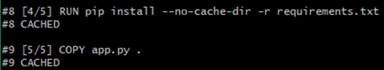

Przebudujmy teraz obraz. Warstwa `pip install` jest CACHED:

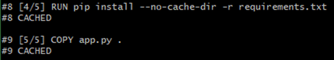

Zmieńmy nieznacznie zawartość pliku `app.py` i przebudujmy obraz. Mimo, że `COPY app.py` jest przebudowywane, `pip install` nadal jest CACHED:

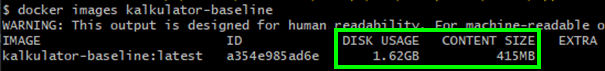

Sprawdźmy rozmiar po optymalizacji. Widać, że nieznacznie się zmniejszył:

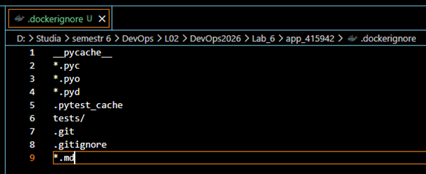

Teraz zajmiemy się dodaniem pliku `.dockerignore`, aby Docker nie wysyłał całego katalogu jako kontekstu budowania, tylko jego niezbędne części. Utwórzmy zatem plik `.dockerignore` i opiszmy typy plików, których nie ma potrzeby wysyłać:

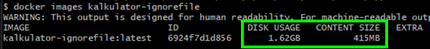

Przebudujmy obraz i sprawdźmy rozmiar. W naszym przypadku nie zmieni się on znacznie, ponieważ cały kontekst waży o wiele mniej niż 1 MB:

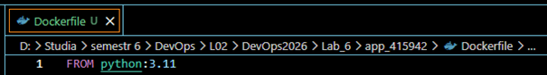

Teraz zajmiemy się zmianą wersji obrazu. Wewnątrz naszego Dockerfile w pierwszej linijce wersję obrazu mamy ustawioną jako `python:3.11`:

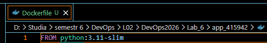

Zmieńmy ją na wersję slim to powinno znacznie zmniejszyć rozmiar obrazu:

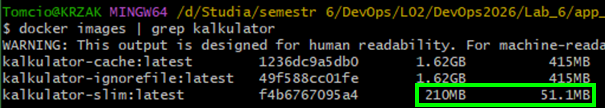

Przebudujmy obraz i porównajmy rozmiar. Możemy zobaczyć, że kilkukrotnie się zmniejszył:

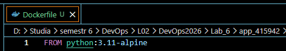

Możemy sprawdzić jeszcze wersję alpine:

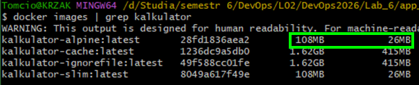

Możemy zobaczyć, że jest ona jeszcze lżejsza, ma ponad 10 razy mniejszy rozmiar od zwykłej wersji `python:3.11`:

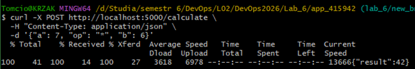

Zweryfikujmy jeszcze poprawność działania aplikacji przeprowadzając test mnożenia 6*7. Dostajemy rezultat 42, więc możemy stwierdzić, że aplikacja działa poprawnie.

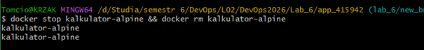

Zatrzymajmy kontener i usuńmy jego definicję:

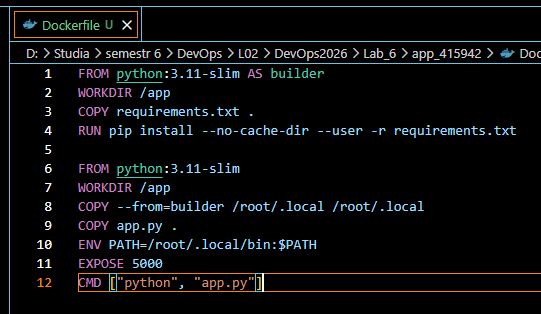

Ostatnią optymalizacją, którą przeprowadzimy będzie pominięcie narzędzi do testowania w buildzie. W tym celu przepiszmy Dockerfile na multi-stage build:

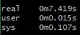

Flaga `--user` w `pip install` powoduje że pakiety trafiają do `/root/.local` zamiast do systemowego `/usr/lib/python3`. Dzięki temu w drugim stage wystarczy skopiować jeden folder (`COPY --from=builder /root/.local /root/.local`) zamiast przenosić całe środowisko systemowe.

Przebudujmy teraz obraz i sprawdźmy czas budowania wraz z rozmiarem obrazu:

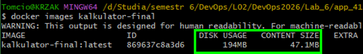

Widzimy, że czas budowania zmniejszył się dwukrotnie względem pierwszego obrazu. Sprawdźmy teraz rozmiar:

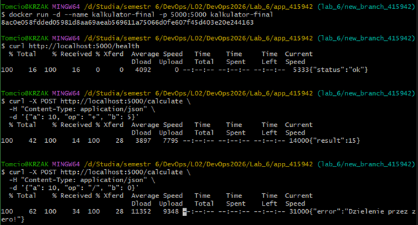

Można zobaczyć, że multi-stage slim ma jeszcze mniejszy rozmiar od poprzedniej wersji slim (chociaż większy niż alpine). Zweryfikujmy na końcu jeszcze poprawność działania zoptymalizowanej aplikacji. Zrobimy dodawanie 10+5 i dzielenie 10/0:

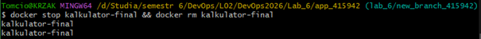

Widzimy że dostajemy status `/health` jako „ok", poprawny wynik dodawania 15 i ostrzeżenie przed dzieleniem przez zero. Ostatecznie zatrzymajmy kontener i usuńmy jego definicję:

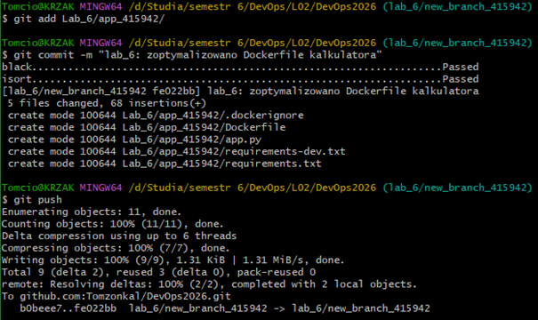

Wykonajmy jeszcze commita i wypchnijmy zmiany:

# Wnioski

Etap | Obraz bazowy | Rozmiar | Co zmieniono
---|---|---|---
Baseline | `python:3.11` | 1,63 GB | 
Po opt. 1 | `python:3.11` | 1,62 GB | Kolejność warstw
Po opt. 2 | `python:3.11` | 1,62 GB | `.dockerignore`
Po opt. 3 | `python:3.11-slim` | 210 MB | Zmiana obrazu bazowego
Test Alpine | `python:3.11-alpine` | 108 MB | Zmiana obrazu bazowego
Po opt. 4 | `python:3.11-slim` | 194 MB | Multi-stage build

W tym laboratorium przeszliśmy przez zaawansowane techniki optymalizacji obrazów kontenerowych, co pozwoliło nam na drastyczne zmniejszenie ich rozmiaru oraz skrócenie czasu budowania aplikacji:

*   **Optymalizacja warstw (Layer Caching)** – zrozumieliśmy, jak Docker wykorzystuje pamięć podręczną. Przeniesienie kopiowania kodu źródłowego (`COPY app.py`) na sam koniec, już po instalacji zależności (`pip install`), zapobiega czasochłonnemu pobieraniu pakietów przy każdej najdrobniejszej zmianie w kodzie.
*   **Zarządzanie kontekstem (`.dockerignore`)** – wykorzystanie pliku ignorowanego do odfiltrowania zbędnych plików (np. folderów `.git`, cache'u Pythona czy plików testowych). Chroni to przed wysyłaniem niepotrzebnych danych do demona Dockera i zapobiega wyciekom niepożądanych plików do finalnego obrazu.
*   **Odpowiedni dobór obrazu bazowego** – świadoma rezygnacja z pełnych, ciężkich obrazów (np. standardowego `python:3.11`) na rzecz ich mocno odchudzonych dystrybucji (`slim` lub `alpine`). Udowodniliśmy, że można zredukować wagę kontenera z ponad 1,6 GB do zaledwie około 100-200 MB.
*   **Wieloetapowe budowanie (Multi-stage build)** – wdrożenie podziału na etap budowania (gdzie instalujemy pakiety i kompilujemy pliki) oraz etap uruchomieniowy. Dzięki instrukcji `COPY --from` do finalnego, produkcyjnego obrazu trafiają wyłącznie niezbędne, gotowe artefakty i zależności, bez zbędnych narzędzi deweloperskich.

Całość dobrze ilustruje najlepsze praktyki tworzenia obrazów produkcyjnych: maksymalne wykorzystanie cache'u → wykluczenie „śmieci” → wybór bezpiecznej i lekkiej bazy → bezwzględne oddzielenie środowiska budowania od środowiska uruchomieniowego.